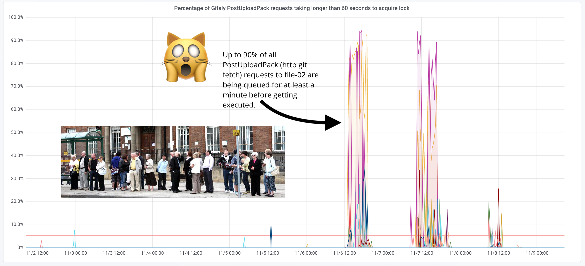

# Gitaly Queuing

## Symptoms

* Gitaly queueing alerts
* High (possibly extremely high) latencies on certain requests but load on Gitaly servers remains low
* Surges in number of active HTTP or SSH sessions

## Further Reading

* Gitaly Concurrency Change: https://gitlab.com/gitlab-org/gitaly/issues/429 and https://gitlab.com/gitlab-org/gitaly/merge_requests/376
* Omnibus Concurrency Change: https://gitlab.com/gitlab-org/omnibus-gitlab/issues/2839
* Chef repo example change: https://ops.gitlab.net/gitlab-cookbooks/chef-repo/commit/5494aabd15641d20bd36f2879c6624036e405f17

## Reference Issues

[**2018-11-06: Up to 15 minute delays on clones from GitLab repositories, including www-gitlab-com, gitlab-ee, gitlab-ce*](https://gitlab.com/gitlab-com/gl-infra/production/issues/553)

* A S2 level incident lasting 3 days, led to disruption to git clones, in particular for the `www-gitlab-com`, `gitlab-ee`, `gitlab-ce`
  although many others were affected to.
* Diagnosis went around in circles:
   * Initially targeted abuse
   * High CI activity rates
   * Workhorse throughput
   * Network issues
   * Gitaly concurrency limits (which had contributed)
* Issue had two major components. HAProxy was thottling all traffic, particularly outbound git traffic. This
  led to longer clone times and a surge in the number of active concurrent sessions.
* The Gitaly rate-limiter then kicked in and was causing major tailbacks.
