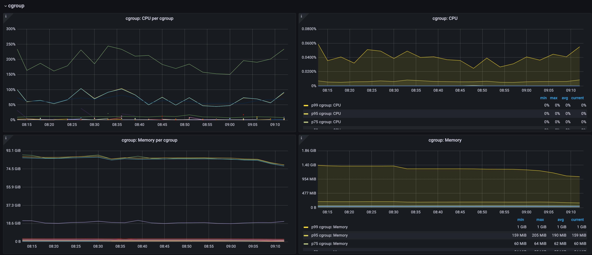

# Gitaly repository cgroups

Each repository will be assigned to a cgroup to enforce resource limits for
memory and cpu (cgroup v1). This implementation of cgroups prevents any one
project from starving other projects from resources. There are several ways to
induce unbounded memory and CPU usage on Gitaly nodes. In general, an unbounded
resource usage pattern can only be fully prevented by adding an upper bound.
Efficiency improvements can help reduce incident frequency, but they cannot
prevent incidents.  For example, if we somehow made git object traversal 5x
more memory efficient, that helps the general case, but a bad actor can still
trigger the same saturation behavior by adding 5x more objects to their repo or
running 5x more concurrent commands. Cgroups provides that missing bounding
behavior. In designing a resource isolation model, we chose the customer
oriented boundary of per-project limits. This boundary is easy for users to
understand and work with, and it matches well with most of the saturation
incidents observed in production, where a single project's git commands
collectively saturated the host's CPU or memory.

The limits are calibrated to ensure that the normal workload on all Gitaly
nodes would not approach the limits. All projects have a generous burst
capacity, but that ceiling is now less than the machine's full capacity. Enough
capacity is reserved that all other projects on the Gitaly host can continue
with their normal workload while any one project is bursting to its limit of
CPU or memory usage.

The cgroup Hierarchy:

```
/sys/fs/cgroup
|
|--memory
|    |--gitaly
|         |--gitaly-<pid>
|               |--memory.limit_in_bytes
|               |--repos-0
|               |     |--memory.limit_in_bytes
|               |--repos-1
|               |     |--memory.limit_in_bytes
|               |--repos-2
|               |     |--memory.limit_in_bytes
|               |--repos-3
|               |     |--memory.limit_in_bytes
|               |--repos-4
|               |     |--memory.limit_in_bytes
|               |--repos-5
|               |     |--memory.limit_in_bytes
|               |--repos-6
|               |     |--memory.limit_in_bytes
|               |--repos-7
|               |     |--memory.limit_in_bytes
|               |--repos-8
|               |     |--memory.limit_in_bytes
|               |--repos-9
|               |     |--memory.limit_in_bytes
|               |--repos-10
|                     |--memory.limit_in_bytes
|
|-cpu
|  |--gitaly
|        |--gitaly-<pid>
|              |--cpu.shares
|              |--repos-0
|              |     |--cpu.shares
|              |     |--cpu.cfs_quota_us
|              |--repos-1
|              |     |--cpu.shares
|              |     |--cpu.cfs_quota_us
|              |--repos-2
|              |     |--cpu.shares
|              |     |--cpu.cfs_quota_us
|              |--repos-3
|              |     |--cpu.shares
|              |     |--cpu.cfs_quota_us
|              |--repos-4
|              |     |--cpu.shares
|              |     |--cpu.cfs_quota_us
|              |--repos-5
|              |     |--cpu.shares
|              |     |--cpu.cfs_quota_us
|              |--repos-6
|              |     |--cpu.shares
|              |     |--cpu.cfs_quota_us
|              |--repos-7
|              |     |--cpu.shares
|              |     |--cpu.cfs_quota_us
|              |--repos-8
|              |     |--cpu.shares
|              |     |--cpu.cfs_quota_us
|              |--repos-9
|              |     |--cpu.shares
|              |     |--cpu.cfs_quota_us
|              |--repos-10
|                    |--cpu.shares
|                    |--cpu.cfs_quota_us
```

- `/gitaly`: Known as hierarchy root, we don't specify any limits, or put any
  pids in this cgroup, it's mostly for memory accounting.
- `/gitaly-<pid>`: Gets created when gitaly starts, we set the uppoer cpu and
  memory limits, we don't put an pids in this.
- `/gitlay-<pid>/repos-0`: The acutal `git` commands go inside of this cgroup,
  where we have cpu and memory limits for those git commands. The `git`
  commands can for 1 or more git repositories, depending on the number of
  cgroups we have.

## Learning about cgroup in Linux

- [Kernel documentation](https://docs.kernel.org/admin-guide/cgroup-v1/)
- [CFS Bandwidth Control](https://docs.kernel.org/scheduler/sched-bwc.html)
- [Understanding and Working with the Cgroups Interface](https://www.youtube.com/watch?v=z7mgaWqiV90)
- [How to understand the linux control groups cgroups](https://www.youtube.com/watch?v=NtK3poD_0X0)

## Reference links for Gitaly cgroup

- [Gitaly cgroup documentation](https://gitlab.com/gitlab-org/gitaly/-/blob/master/doc/cgroups.md)
- [Justification/Original Issue](https://gitlab.com/gitlab-org/gitaly/-/issues/3049)
- [Produciton rollout](https://gitlab.com/gitlab-com/gl-infra/production/-/issues/7723)
- [Infrastructure cgroup epic](https://gitlab.com/groups/gitlab-com/gl-infra/-/epics/344)
- [Rejected RFC](https://gitlab.com/gitlab-org/gitaly/-/merge_requests/2604/diffs)
- [First experiment](https://gitlab.com/gitlab-com/gl-infra/reliability/-/issues/11647)

## Symptoms

- Increase latency due to CPU saturation.
- Higher error rate because we are killing `git` processes.
- High amount of [oom kills](https://log.gprd.gitlab.net/goto/aeea55c0-3d7e-11ed-8d37-e9a2f393ea2a) on the node.

## Monitoring

We monitor gitaly cgroups using
[cadvisor](https://github.com/google/cadvisor/blob/master/docs/storage/prometheus.md),
we only [scrape part of the
information](https://gitlab.com/gitlab-com/gl-infra/chef-repo/-/blob/16beeefdb4086f3139c0b7dbb1fd5d64547c3818/roles/gprd-infra-prometheus-server.json#L1261-1279)
the most interesting ones are:

- `container_cpu_usage_seconds_total`: A counter which specifies the CPU usage of each cgroups, if it's a flat line it might indicate that the cgroup is not being used or it's being saturated.
- `container_cpu_cfs_throttled_seconds_total`: A counter specifies how much we are throttling the cgroup. The high the more throttling we are doing.
- `container_memory_usage_bytes`: A gauge which specifies the usage of memory for that cgroup.

Inside [Gitaly: Host Detail](https://dashboards.gitlab.net/d/gitaly-host-detail/gitaly-host-detail?orgId=1) you can find a `cgroup` panel that will give you information about cgroups:



When a cgroup reaches it quota on memory usage the kernel will OOM kill that
process, which we can see in the [kernel logs](https://log.gprd.gitlab.net/goto/aeea55c0-3d7e-11ed-8d37-e9a2f393ea2ahttps://log.gprd.gitlab.net/goto/aeea55c0-3d7e-11ed-8d37-e9a2f393ea2a).

To find out which `cgroup` was used for the commands that run for a specific RPC you can look at the `json.command.cgroup_path` field.


[source](https://log.gprd.gitlab.net/goto/444e8580-8c37-11ed-85ed-e7557b0a598c)

## Useful debugging commands

1. Find out which cgroups are being used

    ```
    ps -o pid= --ppid $( pidof gitaly ) | xargs -i cat /proc/{}/cgroup 2> /dev/null | awk -F: '$2 ~ /cpu,cpuacct|memory/ { print $2, $3 }' | sort -V | uniq -c
    ```

1. Total number of cgroups created

    ```
    sudo find /sys/fs/cgroup/{cpu,memory}/gitaly -mindepth 1 -type d | wc -l
    ```

1. Get CPU shares

    ```shell
    ssh file-01-stor-gprd.c.gitlab-production.internal -- 'sudo cat /sys/fs/cgroup/cpu,cpuacct/gitaly/gitaly-$(pidof gitaly)/cpu.shares && sudo cat /sys/fs/cgroup/cpu,cpuacct/gitaly/gitaly-$(pidof gitaly)/repos-1/cpu.shares'
    ```

1. Get CPU quota

    ```shell
    ssh file-01-stor-gprd.c.gitlab-production.internal -- 'sudo cat /sys/fs/cgroup/cpu,cpuacct/gitaly/gitaly-$(pidof gitaly)/cpu.cfs_quota_us && sudo cat /sys/fs/cgroup/cpu,cpuacct/gitaly/gitaly-$(pidof gitaly)/repos-1/cpu.cpu_quota_us'
    ```

1. Get Memory limits

    ```shell
    ssh file-01-stor-gprd.c.gitlab-production.internal -- 'sudo cat /sys/fs/cgroup/memory/gitaly/gitaly-$(pidof gitaly)/memory.limit_in_bytes && sudo cat /sys/fs/cgroup/memory/gitaly/gitaly-$(pidof gitaly)/repos-1/memory.limit_in_bytes'
    ```
