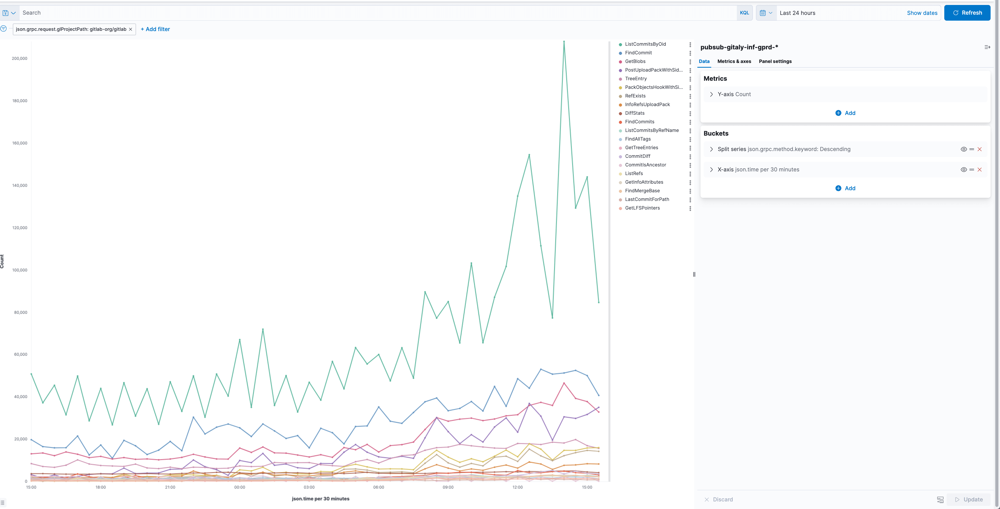

# Moving repositories from one Gitaly node to another

A GitLab Project will have a git repository associated with it which is hosted on a Gitaly node. This can be moved from 1 Gitaly node to another for whatever reason.

## Single Repository

When you want to move a single repository to another Gitaly node we have [glsh
gitaly](https://gitlab.com/gitlab-com/runbooks#running-helper-scripts-from-runbook)
a command where you specify the project ID and it will move the git repository
for that project to another Gitaly node.

```shell
$ glsh gitaly repository move [gstg|gprd] [PROJECT_ID]
$ GITLAB_ADMIN_PAT=xxx glsh gitaly repository move gprd xx
env=gprd project_id=xx msg=scheduling repository for a storage move
env=gprd project_id=xx src=nfs-file65 dest=nfs-file84 msg=schduled repository for a storage move
env=gprd project_id=xx src=nfs-file65 dest=nfs-file84 msg=waiting for repository move to finish
env=gprd project_id=xx src=nfs-file65 dest=nfs-file84 status=started msg=repository storage move status
env=gprd project_id=xx src=nfs-file65 dest=nfs-file84 status=started msg=repository storage move status
env=gprd project_id=xx src=nfs-file65 dest=nfs-file84 status=started msg=repository storage move status
env=gprd project_id=xx src=nfs-file65 dest=nfs-file84 status=started msg=repository storage move status
env=gprd project_id=xx src=nfs-file65 dest=nfs-file84 status=finished msg=repository storage move status
```

When moving a repository, it sets it to read-only so write requests will start
failing, it's good to look at the read/write distribution of a project to
better understand the impact, for example below we see the top 20 RPCs for the
`gitlab-org/gitlab` repository and we can see most requests are read
requests.



[source]( https://log.gprd.gitlab.net/goto/b42f7da0-7a35-11ed-85ed-e7557b0a598c)

### Known issues

- On certain failures on moving repositories, the repository is left read only: [#385309](https://gitlab.com/gitlab-org/gitlab/-/issues/385309)

    ```
    # Run the following to mark repository read/write
    # Inside of the rails console
    project.find_by_id(xxx).update!(repository_read_only: false)
    ```

### Previous examples

- <https://gitlab.com/gitlab-com/gl-infra/production/-/issues/8129>
- <https://gitlab.com/gitlab-com/gl-infra/production/-/issues/8132>

## Mass migration of repositories

This [balancer](https://gitlab.com/gitlab-com/gl-infra/balancer) project is meant to move gitaly repositories in bulk from one Gitaly node to another, in case of storage/disk saturation. The project is hosted on ops.gitlab.net and runs [scheduled job](https://ops.gitlab.net/gitlab-com/gl-infra/balancer/-/pipeline_schedules) to detect overloaded gitaly nodes and pick one (configurable) of them to move repositories away from it to a gitaly node with more available disk space. It currently moves around 1000 GB of project repositories on each run.

### Scheduled job

Currently [scheduled job](https://ops.gitlab.net/gitlab-com/gl-infra/balancer/-/pipeline_schedules) runs in production once a day at 01:00 UTC with following configurations (set via job variables):

- SHARD_LIMIT: 1 (Selects single shard to move repositories from)
- MOVE_AMOUNT: 1000 (Moves 1000 GB of projects or less)
- MOVE_LIMIT: -1 (There is no limit on the amount of repositories to move)

More information on CI variables is available here: <https://ops.gitlab.net/gitlab-com/gl-infra/balancer#using-balancer-through-ci>

### Project docs

For information related to project setup and running the job manually, please refer to project readme: <https://ops.gitlab.net/gitlab-com/gl-infra/balancer/-/blob/main/README.md>
Here is a recorded video of project walkthrough: <https://youtu.be/kEuYNVDpTUk>
