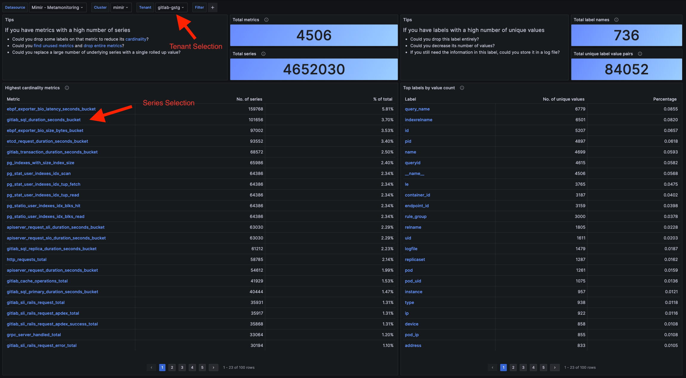
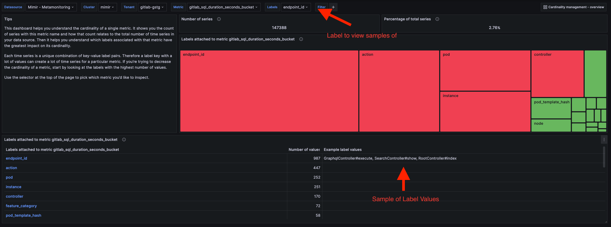
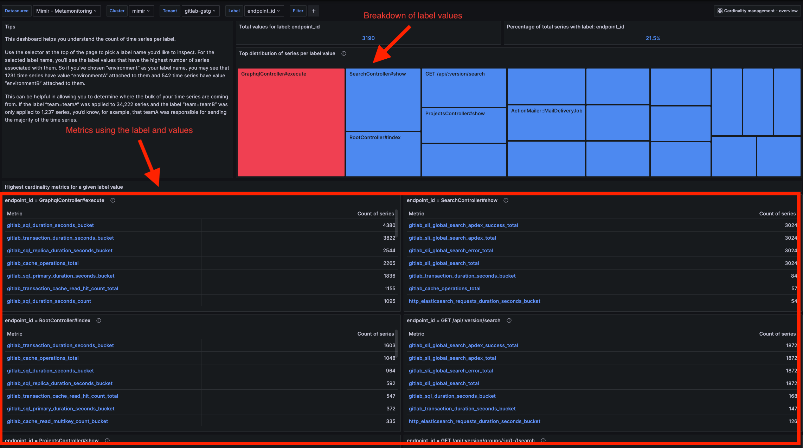

# Cardinality Management

There are a couple of great articles from Grafana around Cardinality which are worth a read before starting:

- [What is cardinality and why does it matter](https://grafana.com/blog/2022/02/15/what-are-cardinality-spikes-and-why-do-they-matter/)
- [How to manage high cardinality metrics](https://grafana.com/blog/2022/10/20/how-to-manage-high-cardinality-metrics-in-prometheus-and-kubernetes/)

Following the second article which references Grafana Cloud, we have implemented a similar set of dashboards you can leverage to dig into cardinality:

- [Cardinality Overview](https://dashboards.gitlab.net/d/cardinality-management/mimir-cardinality-overview?orgId=1)

## Example

Looking at the overview page we have selected the tenant `gitlab-gstg`.

From this view we have a few pieces of information:

- Total Metrics
- Total Series
- Total Unique Label Names
- Total Unique Label/Value Pairs
- Highest Cardinality Metrics
- Top Labels by Value count

Lets pick the `gitlab_sql_duration_seconds_bucket` metric.

If we click on that series, it will take us to a [series drill down dashboard](https://dashboards.gitlab.net/d/cardinality-management-metrics-detail/mimir-cardinality-metrics?var-metric=gitlab_sql_duration_seconds_bucket&var-tenant=gitlab-gprd&orgId=1).

This view drills into the series and shows us a tree map which shows the label names with the highest amount of unique values.

In this example we can see `endpoint_id` is the largest label consumer with `987` unique values.

If we now click on `endpoint_id` from the tree map, we can go into a drill down of this label.

This will take us to a label view where we can see data for this specific label.

Including unique values, and other series using the label/value pairs.

With this data, in this specific example we might be asking:

- How useful is this label?
- What about the unique values, can some of these values be dropped?
- Does it need to be present in all the listed metrics?

Questions like these can help us drastically improve metric performance, as well as our operating costs.
