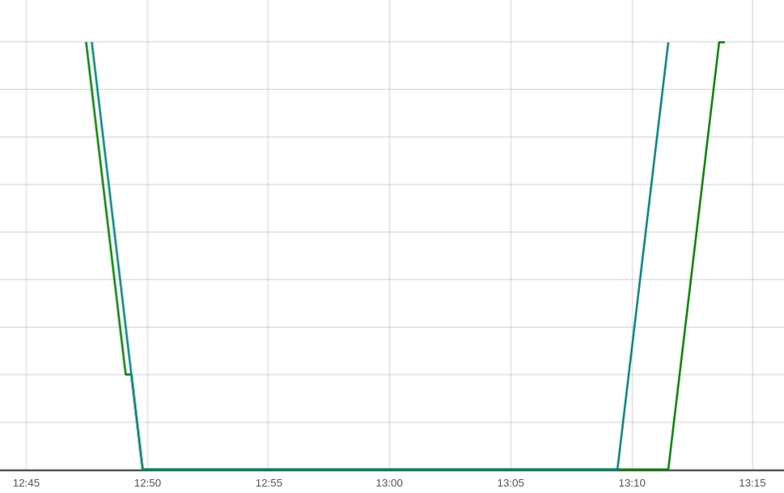

# (Title: Name of alert)

**Table of Contents**

[TOC]

## Overview

### What does this alert mean?

The alert named `PrometheusUnreachable` is set up to detect when Prometheus instances cannot be scraped (i.e., they are unreachable) for more than 10 minutes.

###  What factors can contribute?

CPU and Memory saturation results in unresponsive prometheus instances

###  What parts of the service are effected?

###  What action is the recipient of this alert expected to take when it fires?

Refer [here](https://gitlab.com/gitlab-com/runbooks/-/blob/2cd0f564d4d4d2483e7ee413945726d975e39c90/troubleshooting/prometheus-is-down.md)

#### Steps to check

- Login to server - prometheus.gitlab.com or prometheus-2.gitlab.com.
- Check service with sv status prometheus. If it is run for more than 0s. Then it is ok.
- If it is down state, then check logs in /var/log/prometheus/prometheus/current. Actions can be taken after logs investigating. Usually it is configuration error or IO/space problems.

#### How to work with Prometheus

- Check configuration - /opt/prometheus/prometheus/promtool check config /opt/prometheus/prometheus/prometheus.yml.
- It should check prometheus configuration file and alerts being used. Please always run this check before restarting prometheus      service.
- Reload configuration - sudo sv reload prometheus.
- Restart service - sudo sv restart prometheus after checking configuration.

## Services

- > All alerts require one or more Service Overview links
- > Owner: [Scalability:Observability](https://handbook.gitlab.com/handbook/engineering/infrastructure/team/scalability/observability/)

## Metrics

- #### Briefly explain the metric this alert is based on and link to the metrics catalogue. What unit is it measured in? (e.g., CPU usage in percentage, request latency in milliseconds)

- #### Explain the reasoning behind the chosen threshold value for triggering the alert. Is it based on historical data, best practices, or capacity planning?

- #### Describe the expected behavior of the metric under normal conditions. This helps identify situations where the alert might be falsely firing.

  - On firing the below query under normal conditions in the prometheus dashboard [here](https://prometheus.ops.gitlab.net/graph?g0.expr=avg_over_time(up%7Bjob%3D~%22prometheus.*%22%7D%5B5m%5D)%20*%20100%20&g0.tab=0&g0.stacked=0&g0.show_exemplars=0&g0.range_input=1h)

    `avg_over_time(up{job=~"prometheus.*"}[5m]) * 100 `

    It should ideally come out to be a flat line ( at 100 ) like below , the above query calculates the average availability percentage of Prometheus jobs over the last 5 minutes

    

- #### Add screenshots of what a dashboard will look like when this alert is firing and when it recovers

  - In case the alert is firing you will most probably see a dip in the availability percentage , a good example of how it might
    look like is  below , this has been generated in the prometheus dashboard using the below query

    `avg_over_time(up{job=~"prometheus.*"}[5m]) * 100 < 50`

    

    The above screenshot depicts how the availability fell below 100 but then after sometime how it recovered by itself.

- > Are there any specific visuals or messages one should look for in the screenshots?

## Alert Behavior

- > Information on silencing the alert (if applicable). When and how can silencing be used? Are there automated silencing rules?
- > Expected frequency of the alert. Is it a high-volume alert or expected to be rare?
- > Show historical trends of the alert firing e.g  Kibana dashboard

## Severities

- > Guidance for assigning incident severity to this alert
- > Who is likely to be impacted by this cause of this alert?
  - > All gitlab.com customers or a subset?
  - > Internal customers only?
- > Things to check to determine severity

## Verification

- > Prometheus link to query that triggered the alert
- > Additional monitoring dashboards
- > Link to log queries if applicable

## Recent changes

- > Links to queries for recent related production change requests
- > Links to queries for recent cookbook or helm MR's
- > How to properly roll back changes

## Troubleshooting

- > Basic troubleshooting order
- > Additional dashboards to check
- > Useful scripts or commands

## Possible Resolutions

- > Links to past incidents where this alert helped identify an issue with clear resolutions

- https://gitlab.com/gitlab-com/gl-infra/production/-/issues/17962

## Dependencies

- > Internal and external dependencies which could potentially cause this alert

# Escalation

- > How and when to escalate
- > Slack channels where help is likely to be found:

# Definitions

- > Link to the definition of this alert for review and tuning
- > Advice or limitations on how we should or shouldn't tune the alert
- > Link to edit this playbook
- [Update the template used to format this playbook](https://gitlab.com/gitlab-com/runbooks/-/edit/master/docs/template-alert-playbook.md?ref_type=heads)

# Related Links

- [Related alerts](./)
- > Related documentation
