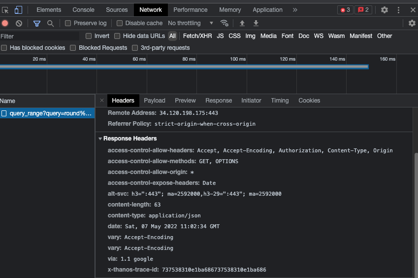
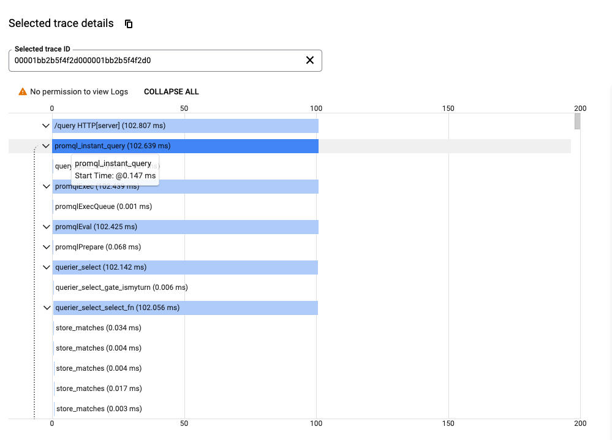
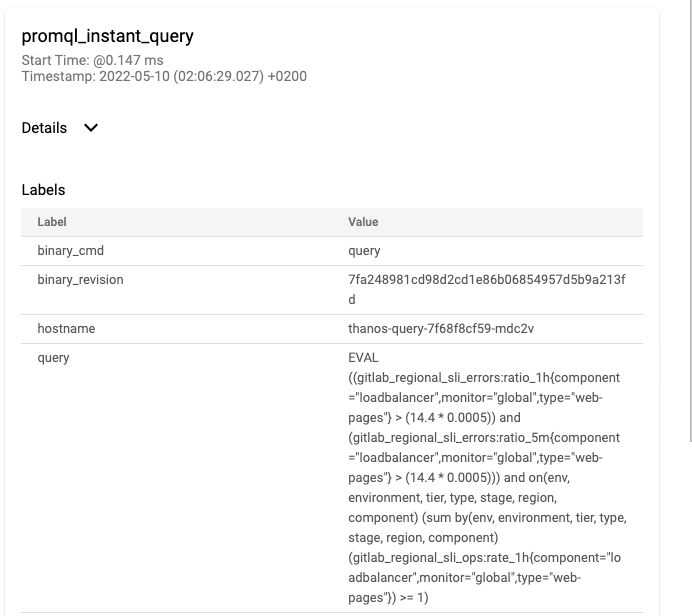

# Stackdriver tracing for the Thanos stack

Thanos will generate traces for all `gRPC` and `HTTP APIs` calls thanks to generic `middlewares`. Each Thanos component generates spans related to its work and sends them to a central place which in our case is [Cloud trace](https://cloud.google.com/trace/). Not every request is sent to Cloud Trace, but only a sample of requests which is configurable. If the HTTP header `X-Thanos-Force-Tracing` is set it will force a request to be traced and saved in Cloud Trace.

## Obtaining Trace ID

Single trace is tied to a single, unique request to the system and is composed of many spans from different components. Trace is identifiable using **Trace ID**, which is a unique hash e.g `131da78f02aa3525`. This information can be also referred to as `request id` and `operation id` in other systems. In order to use trace data you want to find trace IDs that explains the requests you are interested in e.g request with interesting error, or longer latency, or just debug call you just made.

When using tracing with Thanos, you can obtain `trace ID` in [multiple ways](https://thanos.io/tip/thanos/tracing.md/#obtaining-trace-id). For instance open the browser developer tools, navigate to the **network** tab, and under **response headers** you should see text similar to this which contains the `x-thanos-trace-id: 737538310e1ba686737538310e1ba686`. You will then use this ID in the cloud console to inspect that specific span.

## View latency data for the requests in GCP GitLab-ops project

The graph labeled **Select a trace** displays a dot for each request in your selected time interval. The (x,y) coordinates for a request correspond to the time and latency of the request. To view latency date for the requests, navigate to the [Google Console for `gitlab-ops`](https://console.cloud.google.com/traces/list?project=gitlab-ops):

* Click [Trace > Trace List]((https://console.cloud.google.com/traces/list?project=gitlab-ops)) in the Cloud Console navigation menu.
* On the left panel is a timeline (x-axis) of all the sampled requests and their request duration (y-axis)
* Clicking on one them will expand the trace with more information.
* In the **Select a trace** section of the **Trace list page**, click the blue dot, which represents a captured trace. When you hold the pointer over a dot, a tooltip appears that includes the date, time, URI, and latency. The **Latency** column displays the latency for the captured traces. For our case, we can use the `x-thanos-trace-id` we got earlier to filter the trace span and you can also view trace data in the following sections of the Trace list page:

### [Waterfall view](https://cloud.google.com/trace/docs/viewing-details)

This represents a complete request through the application. Each step in the timeline is a span, which you can click to view details.

* If the `access_time` symbol is displayed, then Cloud Trace detected a span whose start time is earlier than the start time of the span's parent. Cloud Trace automatically compensates for this inconsistency when displaying the span; however, the span data isn't modified. The timestamp inconsistency can occur when a service relies on multiple clock sources or different language libraries.
* If the `error` symbol is displayed, then that indicates that the span contains an HTTP error.
* The `name` of the RPC call in the format service_name.call_name. For example, `datastore_v3.RunQuery`.
* The `time` it took to complete the round-trip RPC call.

### [Span details](https://cloud.google.com/trace/docs/viewing-details)

This shows any labels or annotations you added to the app's code when you instrumented it for Trace. It contains detailed information about the row currently highlighted in the waterfall graph where each row in the waterfall graph corresponds to a trace span. If you highlight a row, then the details for that span include its URI name and the relative start time, and the name of the RPC call. The data displayed in the tables varies depending on the element that is highlighted.

