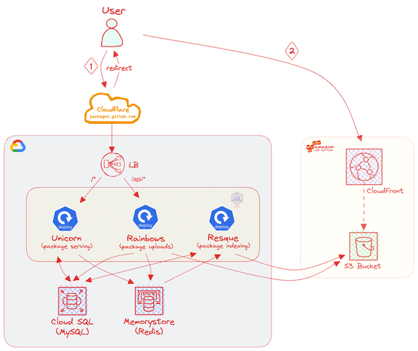

# Packagecloud Infrastructure and Backups

This document will cover how our [packagecloud:enterprise](https://packagecloud.io/) infrastructure works, which is a commercial software package that powers packages.gitlab.com. We will cover the architecture, backups (what is & isn't backed up) and other useful bits such as how to update the license key.

## Architecture Overview

For many years we ran Packagecloud on a single VM with an embedded MySQL DB, Redis and all the other components that it
needs to perform its functions. It was fully self-contained and for the most part it worked OK, but it did cause several
incidents over the years (and more so recently) not only for customers pulling packages, but also for our delivery teams
trying to push out (often time-sensitive) releases. It was also an SPoF; an acronym that makes any SRE nervous.

We tried to decouple workloads away from the VM onto managed services (RDS, Elasticache) and while this did help, we
still ran into issues due to the lack of scaling. As with most problems, there are several solutions and ultimately we
decided to migrate the service from an all-AWS architecture running on a VM to running _most_ of the components
in GCP/GKE leaving only the hard AWS dependencies in AWS (CloudFront & S3).

The current architecture looks like this:

[Excalidraw Diagram](https://excalidraw.com/#json=7_57CiB1PWLy9l0H6JbUe,f39lC3r-o8b_W4NtL4RTbA)

See [#24245](https://gitlab.com/gitlab-com/gl-infra/reliability/-/issues/24245) for more context.

[Memory Store and CloudSQL config in Terraform](https://ops.gitlab.net/gitlab-com/gl-infra/config-mgmt/-/blob/master/environments/ops/packagecloud.tf)

## Environments

| Environment | URL                             | GKE Cluster    | CloudFlare | Terraform                                                                                             |
|-------------|---------------------------------|----------------|:----------:|-------------------------------------------------------------------------------------------------------|
| pre         | <https://packages.gke.gitlab.net> | pre-gitlab-gke |     ❌     | <https://ops.gitlab.net/gitlab-com/gl-infra/config-mgmt/-/blob/master/environments/pre/packagecloud.tf> |
| ops         | <https://packages.gitlab.com>     | ops-gitlab-gke |     ✅     | <https://ops.gitlab.net/gitlab-com/gl-infra/config-mgmt/-/blob/master/environments/ops/packagecloud.tf> |

## How does Packagecloud work?

Packagecloud is provided as an Omnibus package, just like GitLab. This package includes everything that one would need
to begin using Packagecloud.

Since Packagecloud.io do not currently offer a Docker image (much less a Helm chart) for their app, we
created our own custom [Packagecloud image](https://gitlab.com/gitlab-com/gl-infra/ci-images/-/tree/master/packagecloud)
and [Helm chart](https://gitlab.com/gitlab-com/gl-infra/charts/-/tree/main/gitlab/packagecloud). Our Docker image runs
their Omnibus package, which is designed for running on VMs and not as a container so we've had to make some changes.
For example: we can't use `systemd` as it would require running as a privileged container (plus it goes against the
model of running a single service per container) so we install a no-op `systemd` binary purely for Chef to pass. We then
do what `systemd` would do but inside our entrypoint script.

Packagecloud is made up of several components:

1. **nginx** -- routes requests to either unicorn or rainbows
1. **unicorn** (_package serving_) -- requests for the UI & packages (RPMs, DEBs, etc) are served by a set of Unicorn
   processes.
1. **rainbows** (_package uploading_) -- package uploads are handled by a set of Rainbows processes. These processes
   receive packages, write metadata into the DB and uploads them to S3.
1. **resque** (_package indexing_) -- a set of background workers responsible for indexing packages once they have been
   uploaded and processed by rainbows.

When a package download request is requested, Packagecloud will query the database and if found, it will return a `302`
redirect to the user to a CloudFront time-limited URL, which will either return the package from cache or fetch from S3.

**NOTE**: almost all GCP & AWS resources are managed by Terraform. The exception is CloudFront, which is created &
managed by Packagecloud itself so you will not find it in the Terraform resources. The AWS credentials used by
Packagecloud provide sufficient access to manage the CloudFront distribution and related resources (e.g., lambda
function).

## K8S

To split up the Packagecloud components so that we can fine-tune each one individually, we run several deployments:

- `web` -- runs nginx & unicorn.
- `rainbows` -- runs nginx, unicorn & rainbows.
- `resque` -- runs resque only
- `toolbox` -- runs no services. Used only for performing ad-hoc MySQL queries, troubleshooting, etc.

The GCP Ingress that sits in front of these deployments is configured to route as follows:

- `/*` -> `web`
- `/api/*` -> `rainbows`

The main configuration is in [K8s-workloads](https://gitlab.com/gitlab-com/gl-infra/k8s-workloads/gitlab-helmfiles/-/blob/master/releases/packagecloud/ops.yaml.gotmpl)

### Why does the rainbows container also run nginx & unicorn?

It's because we can't configure the ingress to **only** route `POST` API requests to rainbows. It is simple path
based matching, so we route all of `/api/*` to rainbows. This means that if there's a `GET` request for the API, we need
unicorn to process it, but it will get routed to the rainbows deployment due to the path match, so this is why we have
nginx & unicorn running inside the rainbows container.

## Backups

Packagecloud comes with functionality to backup its local embedded DB & config files. Both of these settings are disabled because:

1. We don't use the embedded MySQL database. We use an external DB (Cloud SQL) so we rely on Google-managed [daily automated backups](https://console.cloud.google.com/sql/instances/packagecloud-f05c90f5/backups?project=gitlab-ops). We currently keep 30 days worth of backups.
1. We don't need to backup the configuration files as it's all managed inside the [packagecloud release](https://gitlab.com/gitlab-com/gl-infra/k8s-workloads/gitlab-helmfiles/-/tree/master/releases/packagecloud) and the [packagecloud chart](https://gitlab.com/gitlab-com/gl-infra/charts/-/tree/main/gitlab/packagecloud).

### S3

There is no need to backup the `packages-gitlab-com` bucket itself as it is S3, which is a service designed with many 9s
of durability. Additionally, we have enabled [cross-region
replication](http://docs.aws.amazon.com/AmazonS3/latest/dev/crr.html) so the bucket is replicated to
`packages-gitlab-com-replica`, which is in `eu-central-1`.
