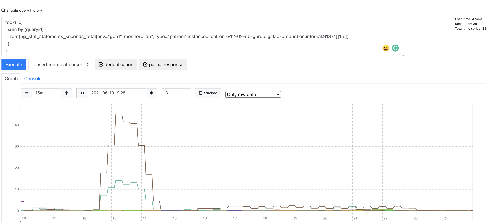
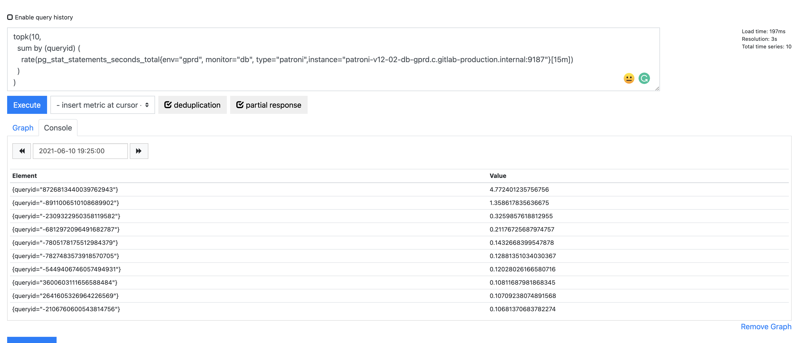
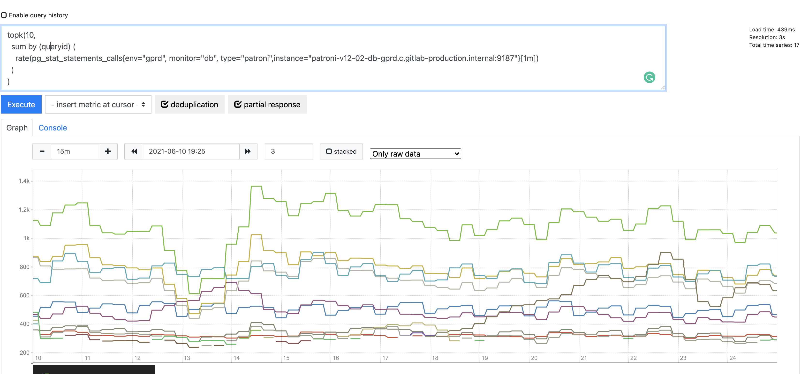

## Database Peak Analysis Report

The goal of this report is to detail what is being executed in the primary database of the PostgreSQL cluster during a CPU utilization peak.

The CPU utilization peak represent that some queries are generating an excessive load on the database server and could impact the SLA, availability and performance from the database host.

I will use as an example the issue: <https://gitlab.com/gitlab-com/gl-infra/reliability/-/issues/13536>

### How we identify the CPU utilization peaks?

Using this dashboard we can see the primary CPU utilization. Currently, the criteria used to generate a report are all the peaks over 50% of CPU utilization. Please consider that this number could increase, and we consider a peak when is 80% to 100% over the average CPU utilizatain. For example if the CPU utilization is 25% a 50% could trigger an investigation since is 100% more than the average at that moment.

<https://dashboards.gitlab.net/d/bd2Kl9Imk/host-stats?viewPanel=8&orgId=1&var-env=gprd&var-node=patroni-v12-02-db-gprd.c.gitlab-production.internal>

Please remember to filter this dashboard by the Primary database host. The primary can change regularly. To see which server is the current primary view this [dashboard](https://dashboards.gitlab.net/d/000000244/postgresql-replication-overview?orgId=1&from=now-3h&to=now&var-prometheus=Global&var-environment=gprd&var-type=patroni)

### How we create the issue

The title from the issue is: Database performance peak [day of the peak] [month of the peak] - [time that the peak reached the maximum CPU utilization]

In the body from the issue:

```
The following CPU utilization peak started at [time that started the peak], reaching [maximum CPU utilization%]:


Acceptance Criteria:


-[ ] Evaluate the analysis report, metrics and queries. If applicable, create new issues with the label `infradev` or datastores to propose new improvements to the database cluster overall.

```

#### What are the sections that we add in the report

Our PostgreSQL exporter, exports metrics to Thanos from pg_stat_statements, which is really useful in this scenario, every time that a query is executed is added in this view. There is a limit of 5000 queries that we gather info, in the case of a statement that is not used frequently we can have the scenario where this query is evicted from the pg_stat_statements view.

Having these metrics in a timeline we execute a search for what is being executed in a range of 15 minutes by some criteria:

#### total time

we filter for the 10 statements that consumed more time during the peak time.

The PROMQL query is :

```
topk(10,
  sum by (queryid) (
    rate(pg_stat_statements_seconds_total{env="gprd", monitor="db", type="patroni",instance="patroni-v12-02-db-gprd.c.gitlab-production.internal:9187"}[1m])
  )
)
```

In the fields of the graph please choose the interval of 15 minutes and few minutes after the peak, the search will be 15 minutes recursive, in our example, the value is: 2021-06-10 19:25

Click on the execute button to render the graph.

the link to this query:

<https://thanos.gitlab.net/graph?g0.range_input=15m&g0.end_input=2021-06-10%2019%3A25&g0.step_input=3&g0.moment_input=2021-03-20%2020%3A20%3A00&g0.max_source_resolution=0s&g0.expr=topk(10%2C%20%0A%20%20sum%20by%20(queryid)%20(%0A%20%20%20%20rate(pg_stat_statements_seconds_total%7Benv%3D%22gprd%22%2C%20monitor%3D%22db%22%2C%20type%3D%22patroni%22%2Cinstance%3D%22patroni-v12-02-db-gprd.c.gitlab-production.internal%3A9187%22%7D%5B1m%5D)%0A%20%20)%0A)&g0.tab=0>

Where we can see 1 statements is above the average in the graph

QueryId: 8726813440039762943  ( at this moment you can scroll the mouse over the different lines to see the queryId)



Now we want to find the query ids from the top 10 statements of this query:

Click on the button:

we need to adapt our query to:

```
topk(10,
  sum by (queryid) (
    rate(pg_stat_statements_seconds_total{env="gprd", monitor="db", type="patroni",instance="patroni-v12-02-db-gprd.c.gitlab-production.internal:9187"}[15m])
  )
)
```

The only variable that changed is the aggregation time from [1m] to [15m]. Since the objective is to summarize what we have seen in the graph.

And change the target date and time to the same as in the graph. In our case: 2021-06-10 19:25.

Click at the button execute to generate the table with the information requested.



As we can see we have a table with the reference of the queryIds:

|Element | Value|
|--------|-------|
|{queryid="8726813440039762943"}|0.32587678584709967|
|{queryid="-6812972096491682787"}|0.2200382826448832|
|{queryid="-2309322950358119582"}|0.11861903058209768|
|{queryid="2641605326964226569"}|0.1068977698868063|
|{queryid="3600603111656588484"}|0.09702261557815492|
|{queryid="-7827483573918570705"}|0.09480982187087647|
|{queryid="-2106760600543814756"}|0.09329789899477166|
|{queryid="-6000510059798491917"}|0.08244985281942514|
|{queryid="-8911006510108689902"}|0.07096281822046471|
|{queryid="5637456866954582000"}|0.0688175106595736|

Now we have the list, as you can see the queryId we recognized as consuming more time to resolve ( 8726813440039762943 ) being the first row in this table too.

The next step is to find what SQL statement is each one of these queryIds. To gather this information, you need to connect to the primary database host, open a `gitlab-psql` session, and issue the following command:

* I recommend using the command `\a` in the `gitlab-psql` session, before executing the query, to get the output unaligned. It will be easier to generate the next table.

```
SELECT
 queryid,
 query
FROM
 pg_stat_statements
WHERE queryid IN ('8726813440039762943','-6812972096491682787', '-2309322950358119582', '2641605326964226569', '3600603111656588484', '-7827483573918570705', '-2106760600543814756', '-6000510059798491917', '-8911006510108689902', '5637456866954582000') ;
```

Or if you want a specific query you can execute the follow SQL command:

```
SELECT
 queryid,
 query
FROM
 pg_stat_statements
WHERE queryid ='8726813440039762943';
```

Those query ids are the following SQL statements:

| QueryId | Query |
|---------|-------|
| 8726813440039762943 |/*application:sidekiq,correlation_id:01F7HWR7B46Q5S8QGP8MTZ7BG5,jid:ce7921e9ee2a1c66e3072cb9,endpoint_id:AuthorizedProjectsWorker*/ WITH RECURSIVE "namespaces_cte" AS ((SELECT "namespaces"."id", "members"."access_level" FROM "namespaces" INNER JOIN "members" ON "namespaces"."id" = "members"."source_id" WHERE "members"."type" = $1 AND "members"."source_type" = $2 AND "namespaces"."type" = $3 AND "members"."user_id" = $4 AND "members"."requested_at" IS NULL AND (access_level >= $5)) UNION (SELECT "namespaces"."id", LEAST("members"."access_level", "group_group_links"."group_access") AS access_level FROM "namespaces" INNER JOIN "group_group_links" ON "group_group_links"."shared_group_id" = "namespaces"."id" INNER JOIN "members" ON "group_group_links"."shared_with_group_id" = "members"."source_id" AND "members"."source_type" = $6 AND "members"."requested_at" IS NULL AND "members"."user_id" = $7 AND "members"."access_level" > $8 WHERE "namespaces"."type" = $9) UNION (SELECT "namespaces"."id", GREATEST("members"."access_level", "namespaces_cte"."access_level") AS access_level FROM "namespaces" INNER JOIN "namespaces_cte" ON "namespaces_cte"."id" = "namespaces"."parent_id" LEFT OUTER JOIN "members" ON "members"."source_id" = "namespaces"."id" AND "members"."source_type" = $10 AND "members"."requested_at" IS NULL AND "members"."user_id" = $11 AND "members"."access_level" > $12 WHERE "namespaces"."type" = $13)) SELECT "project_authorizations"."project_id", MAX(access_level) AS access_level FROM ((SELECT projects.id AS project_id, members.access_level FROM "projects" INNER JOIN "members" ON "projects"."id" = "members"."source_id" WHERE "members"."type" = $14 AND "members"."source_type" = $15 AND "members"."user_id" = $16 AND "members"."requested_at" IS NULL) UNION (SELECT projects.id AS project_id, $17 AS access_level FROM "projects" INNER JOIN "namespaces" ON "projects"."namespace_id" = "namespaces"."id" WHERE "namespaces"."owner_id" = $18 AND "namespaces"."type" IS NULL) UNION (SELECT "projects"."id" AS project_id, "namespaces"."access_level" FROM "namespaces_cte" "namespaces" INNER JOIN "projects" ON "projects"."namespace_id" = "namespaces"."id") UNION (SELECT "project_group_links"."project_id", LEAST("namespaces"."access_level", "project_group_links"."group_access") AS access_level FROM "namespaces_cte" "namespaces" INNER JOIN project_group_links ON project_group_links.group_id = namespaces.id INNER JOIN projects ON projects.id = project_group_links.project_id INNER JOIN namespaces p_ns ON p_ns.id = projects.namespace_id WHERE (p_ns.share_with_group_lock IS FALSE))) project_authorizations GROUP BY "project_authorizations"."project_id" |
|-8911006510108689902 | /*application:sidekiq,correlation_id:01F7HWR7B46Q5S8QGP8MTZ7BG5,jid:e28658e88753abf0df5f6ccf,endpoint_id:AuthorizedProjectsWorker*/ SELECT "project_authorizations"."project_id", "project_authorizations"."access_level" FROM "project_authorizations" WHERE "project_authorizations"."user_id" = $1 |
| -2309322950358119582|/*application:sidekiq,correlation_id:01F5674N38JY1BXZN23B6X33B8,jid:f25a38c1fe96c9d7b38fc400,endpoint_id:PostReceive*/ SELECT "ci_pipelines".*FROM "ci_pipelines" WHERE "ci_pipelines"."project_id" = $1 AND ("ci_pipelines"."source" IN ($2, $3, $4, $5, $6, $7, $8, $9, $10, $11, $12) OR "ci_pipelines"."source" IS NULL) AND "ci_pipelines"."ref" = $13 AND "ci_pipelines"."id" NOT IN (WITH RECURSIVE "base_and_descendants" AS ((SELECT "ci_pipelines".* FROM "ci_pipelines" WHERE "ci_pipelines"."id" = $14) UNION (SELECT "ci_pipelines".*FROM "ci_pipelines", "base_and_descendants", "ci_sources_pipelines" WHERE "ci_sources_pipelines"."pipeline_id" = "ci_pipelines"."id" AND "ci_sources_pipelines"."source_pipeline_id" = "base_and_descendants"."id" AND "ci_sources_pipelines"."source_project_id" = "ci_sources_pipelines"."project_id")) SELECT "id" FROM "base_and_descendants" AS "ci_pipelines") AND "ci_pipelines"."sha" != $15 AND ("ci_pipelines"."status" IN ($16,$17,$18,$19,$20,$21)) AND (NOT EXISTS (SELECT "ci_builds".* FROM "ci_builds" INNER JOIN "ci_builds_metadata" ON "ci_builds_metadata"."build_id" = "ci_builds"."id" WHERE "ci_builds"."type" = $22 AND (ci_builds.commit_id = ci_pipelines.id) AND ("ci_builds"."status" IN ($23,$24,$25)) AND "ci_builds_metadata"."id" NOT IN (SELECT "ci_builds_metadata"."id" FROM "ci_builds_metadata" WHERE (ci_builds_metadata.build_id = ci_builds.id) AND "ci_builds_metadata"."interruptible" = $26))) ORDER BY "ci_pipelines"."id" ASC LIMIT $27 |
| -6812972096491682787|/*application:web,correlation_id:01F55SGG3SY4NKQ02TTWXGA29Q,endpoint_id:GET /api/:version/projects/:id/users*/ SELECT "users".* FROM "users" INNER JOIN "project_authorizations" ON "users"."id" = "project_authorizations"."user_id" WHERE "project_authorizations"."project_id" = $1 |
| -7805178175512984379 | /*application:sidekiq,correlation_id:01F7J00Y4PX1JP1JPPTB87MMNG,jid:a256f85c7e488bf99360eb8f,endpoint_id:Deployments::DropOlderDeploymentsWorker*/ SELECT "deployments".* FROM "deployments" INNER JOIN ci_builds ON ci_builds.id = deployments.deployable_id WHERE "deployments"."environment_id" = $1 AND "deployments"."status" IN ($2, $3) AND (deployments.id < $4) ORDER BY "deployments"."id" ASC LIMIT $5 |
|-7827483573918570705|/*application:sidekiq,correlation_id:01F64GYFW1QJD86JSR88K30V83,jid:517767b53424be66f7264b41,endpoint_id:BuildFinishedWorker*/ SELECT $1 AS one FROM "projects" WHERE "projects"."namespace_id" IN (WITH RECURSIVE "base_and_descendants" AS ((SELECT "namespaces".*FROM "namespaces" WHERE "namespaces"."type" = $2 AND "namespaces"."id" = $3) UNION (SELECT "namespaces".* FROM "namespaces", "base_and_descendants" WHERE "namespaces"."type" = $4 AND "namespaces"."parent_id" = "base_and_descendants"."id")) SELECT id FROM "base_and_descendants" AS "namespaces") AND "projects"."shared_runners_enabled" = $5 LIMIT $6 |
| -5449406746057494931 | /*application:sidekiq,correlation_id:b53d066ae49609e3392adf77d3f341e5,jid:fc80b3f153ec188a6d2982ae,endpoint_id:Database::BatchedBackgroundMigrationWorker*/ UPDATE "ci_builds_metadata" SET "build_id_convert_to_bigint" = "build_id" WHERE "ci_builds_metadata"."id" BETWEEN $1 AND $2 AND "ci_builds_metadata"."id" >= $3 AND "ci_builds_metadata"."id" < $4  |
| 3600603111656588484 |  /*application:web,correlation_id:01F5673WZQ58DF48AKY4QZAEMD,endpoint_id:POST /api/:version/projects/:id/merge_requests/:merge_request_iid/approve*/ UPDATE "projects" SET "last_activity_at" = $1 WHERE "projects"."id" = $2 AND (last_activity_at <= $3) |
| 2641605326964226569|/*application:sidekiq,correlation_id:01F6ZC2739FNVJY6HJ9F6EWMFW,jid:c54c6acdcb90e3a15df40ecd,endpoint_id:BuildQueueWorker*/ SELECT $1 AS one FROM "projects" WHERE "projects"."namespace_id" IN (SELECT traversal_ids[array_length(traversal_ids, $2)] AS id FROM "namespaces" WHERE (traversal_ids @> ($3))) AND "projects"."shared_runners_enabled" = $4 LIMIT $5 |
| -2106760600543814756 | /*application:web,correlation_id:01F55SFTXF2PJF7PZW5QPWNB5X*/ SELECT "ci_builds".* FROM "ci_builds" WHERE "ci_builds"."type" = $1 AND "ci_builds"."token_encrypted" IN ($2, $3) LIMIT $4 |

Let's analyze the first row since we noticed that consumed more time to resolve:

| QueryId | Query |
|---------|-------|
| 8726813440039762943 |/*application:sidekiq,correlation_id:01F7HWR7B46Q5S8QGP8MTZ7BG5,jid:ce7921e9ee2a1c66e3072cb9,endpoint_id:AuthorizedProjectsWorker*/ WITH RECURSIVE "namespaces_cte" AS ((SELECT "namespaces"."id", "members"."access_level" FROM "namespaces" INNER JOIN "members" ON "namespaces"."id" = "members"."source_id" WHERE "members"."type" = $1 AND "members"."source_type" = $2 AND "namespaces"."type" = $3 AND "members"."user_id" = $4 AND "members"."requested_at" IS NULL AND (access_level >= $5)) UNION (SELECT "namespaces"."id", LEAST("members"."access_level", "group_group_links"."group_access") AS access_level FROM "namespaces" INNER JOIN "group_group_links" ON "group_group_links"."shared_group_id" = "namespaces"."id" INNER JOIN "members" ON "group_group_links"."shared_with_group_id" = "members"."source_id" AND "members"."source_type" = $6 AND "members"."requested_at" IS NULL AND "members"."user_id" = $7 AND "members"."access_level" > $8 WHERE "namespaces"."type" = $9) UNION (SELECT "namespaces"."id", GREATEST("members"."access_level", "namespaces_cte"."access_level") AS access_level FROM "namespaces" INNER JOIN "namespaces_cte" ON "namespaces_cte"."id" = "namespaces"."parent_id" LEFT OUTER JOIN "members" ON "members"."source_id" = "namespaces"."id" AND "members"."source_type" = $10 AND "members"."requested_at" IS NULL AND "members"."user_id" = $11 AND "members"."access_level" > $12 WHERE "namespaces"."type" = $13)) SELECT "project_authorizations"."project_id", MAX(access_level) AS access_level FROM ((SELECT projects.id AS project_id, members.access_level FROM "projects" INNER JOIN "members" ON "projects"."id" = "members"."source_id" WHERE "members"."type" = $14 AND "members"."source_type" = $15 AND "members"."user_id" = $16 AND "members"."requested_at" IS NULL) UNION (SELECT projects.id AS project_id, $17 AS access_level FROM "projects" INNER JOIN "namespaces" ON "projects"."namespace_id" = "namespaces"."id" WHERE "namespaces"."owner_id" = $18 AND "namespaces"."type" IS NULL) UNION (SELECT "projects"."id" AS project_id, "namespaces"."access_level" FROM "namespaces_cte" "namespaces" INNER JOIN "projects" ON "projects"."namespace_id" = "namespaces"."id") UNION (SELECT "project_group_links"."project_id", LEAST("namespaces"."access_level", "project_group_links"."group_access") AS access_level FROM "namespaces_cte" "namespaces" INNER JOIN project_group_links ON project_group_links.group_id = namespaces.id INNER JOIN projects ON projects.id = project_group_links.project_id INNER JOIN namespaces p_ns ON p_ns.id = projects.namespace_id WHERE (p_ns.share_with_group_lock IS FALSE))) project_authorizations GROUP BY "project_authorizations"."project_id" |

in the field query we have a SQL comment called marginalia: /*application:sidekiq,correlation_id:01F7HWR7B46Q5S8QGP8MTZ7BG5,jid:ce7921e9ee2a1c66e3072cb9,endpoint_id:AuthorizedProjectsWorker*/, that is generated by the application and help us to identify what  application and endpoint generated the query.

#### calls

 we filter for the 10 statements that have more calls during the peak time.

 We follow the same process as for the total time, just considering a different PROMQL query:

 ```
 topk(10,
  sum by (queryid) (
    rate(pg_stat_statements_calls_total{env="gprd", monitor="db", type="patroni",instance="patroni-v12-02-db-gprd.c.gitlab-production.internal:9187"}[1m])
  )
)
 ```

 

### Slow log analysis

All the queries that take more than 1 second to resolve are logged by PostgreSQL. The logs are available in ELK.

We can execute queries on Kibana to verify what statements took more time to resolve in the logs too. This verification can be an instrumental analysis to understand the root cause of the peak.

We have the following video from Andrew on how to create the visualization of the top queries and the consumed time, step by step:
<https://www.loom.com/share/cfd5878b1e894e019ccde7768149ca17>

When we are in discovery mode, look for the info of the endpoint and the SQL statement. Consider that the peak info here can have a slight delay since it is after the statement's conclusion when we have the information in the logs.

Please look at the following visualization based on fingerprints from the queries:

<https://log.gprd.gitlab.net/goto/8f45712823ee99eceebf4fb2a6e87671>

You can use the query above and adjust the time frame to help you in your analysis.

In our test case, the query Is:

Endpoint: `RunPipelineScheduleWorker`

SQL statement:

```
SELECT "ci_pipelines".* FROM "ci_pipelines" WHERE "ci_pipelines"."project_id" = $1 AND ("ci_pipelines"."source" IN ($2, $3, $4, $5, $6, $7, $8, $9, $10, $11, $12) OR "ci_pipelines"."source" IS NULL) AND "ci_pipelines"."ref" = $13 AND "ci_pipelines"."id" NOT IN (WITH RECURSIVE "base_and_descendants" AS ((SELECT "ci_pipelines".* FROM "ci_pipelines" WHERE "ci_pipelines"."id" = $14)
UNION
(SELECT "ci_pipelines".* FROM "ci_pipelines", "base_and_descendants", "ci_sources_pipelines" WHERE "ci_sources_pipelines"."pipeline_id" = "ci_pipelines"."id" AND "ci_sources_pipelines"."source_pipeline_id" = "base_and_descendants"."id" AND "ci_sources_pipelines"."source_project_id" = "ci_sources_pipelines"."project_id")) SELECT "id" FROM "base_and_descendants" AS "ci_pipelines") AND "ci_pipelines"."sha" != $15 AND ("ci_pipelines"."status" IN ($16,$17,$18,$19,$20,$21)) AND (NOT EXISTS (SELECT "ci_builds".* FROM "ci_builds" INNER JOIN "ci_builds_metadata" ON "ci_builds_metadata"."build_id" = "ci_builds"."id" WHERE "ci_builds"."type" = $22 AND (ci_builds.commit_id = ci_pipelines.id) AND ("ci_builds"."status" IN ($23,$24,$25)) AND "ci_builds_metadata"."id" NOT IN (SELECT "ci_builds_metadata"."id" FROM "ci_builds_metadata" WHERE (ci_builds_metadata.build_id = ci_builds.id) AND "ci_builds_metadata"."interruptible" = $26))) ORDER BY "ci_pipelines"."id" ASC LIMIT $27
```

Another interesting point is to gather the correlation_id : `88d37640225e9715618d1d8ff5`

Look in the rails logs and sidekiq for entries that we could gather the following information:

* Class
* caller_id
* db_primary_duration_s
