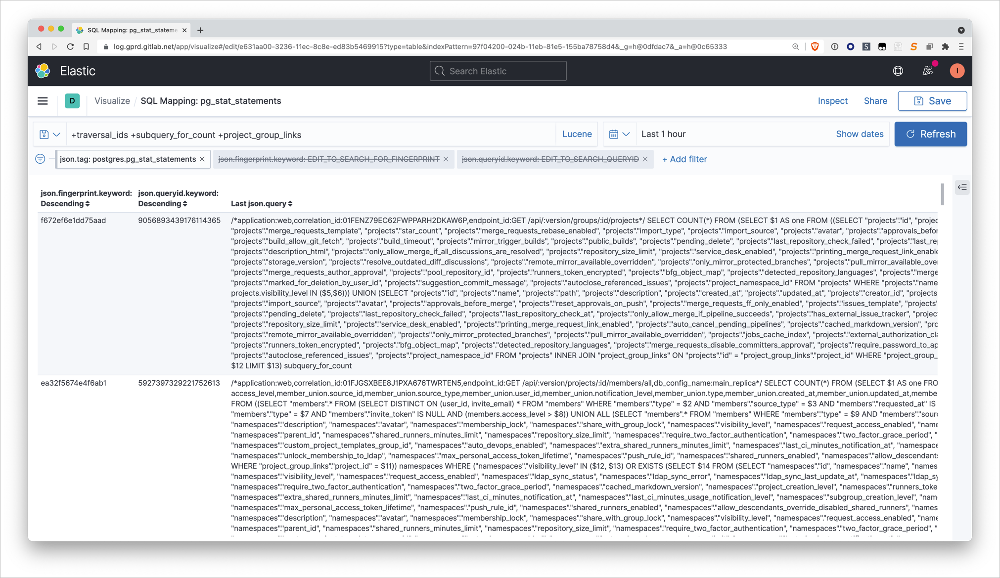
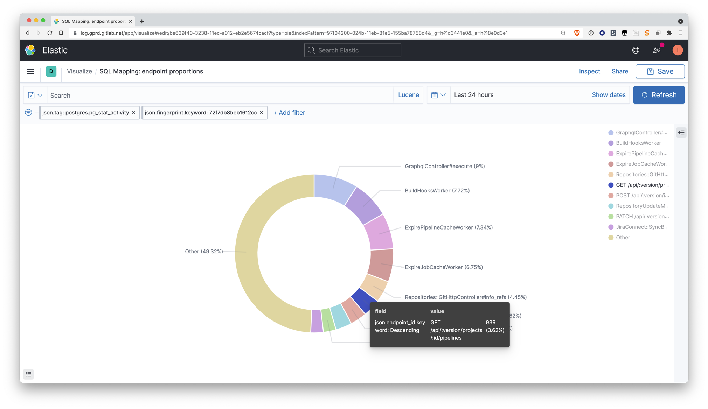
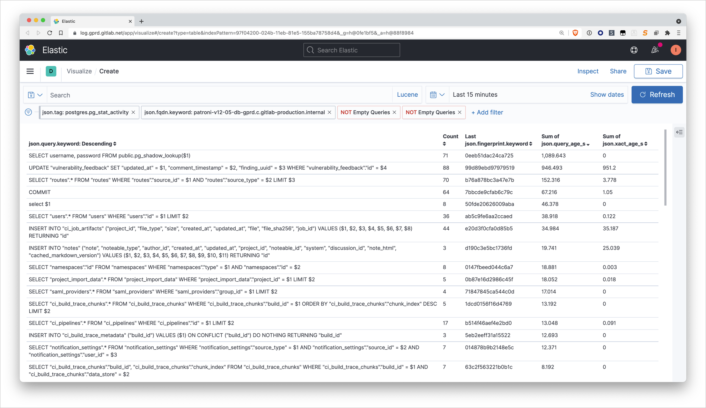
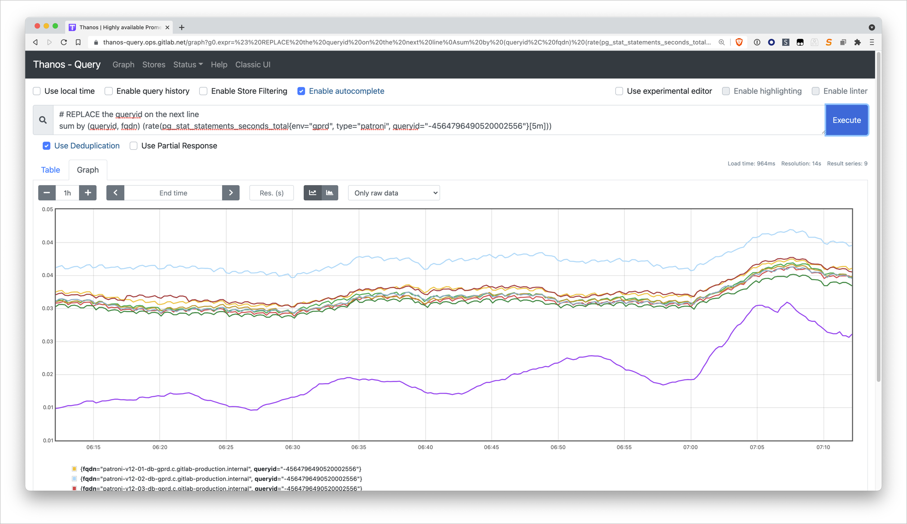

# Mapping Postgres Statements, Slowlogs, Activity Monitoring and Traces

**Table of Contents**

[TOC]

Understanding the workloads that the application is sending to the database is critical to diagnosing performance issues.

GitLab's Postgres cluster has several tools for understanding these workloads, including:

1. **[`pg_stat_statements`](https://www.postgresql.org/docs/12/pgstatstatements.html)** - this Postgres module provides a means for tracking execution statistics of all SQL statements executed by a server. Statements are grouped by `queryid`, an internal hash code, computed from the statement's parse tree. This means that statements that only differ by values will have matching `queryid`s.
1. **[`pg_stat_activity`](https://www.postgresql.org/docs/12/monitoring-stats.html)** is a subsystem that supports collection and reporting of information about server activity. `pg_stat_activity` information incudes the SQL query running, but no `queryid`, so can be tricky to map back to `pg_stat_statements`.
1. **[`postgres_exporter`](https://gitlab.com/gitlab-cookbooks/gitlab-exporters/)** this exporter polls Postgres and returns data from `pg_stat_statements` (and many other subsystems) into Prometheus. `pg_stat_statements` is exported as the metrics [`pg_stat_statements_calls`](https://thanos.gitlab.net/graph?g0.expr=topk(100%2C%20sum%20by%20(queryid%2C%20fqdn)%20(rate(pg_stat_statements_calls%7Benv%3D%22gprd%22%2C%20type%3D%22patroni%22%7D%5B5m%5D)))&g0.tab=1&g0.stacked=0&g0.range_input=1h&g0.max_source_resolution=0s&g0.deduplicate=1&g0.partial_response=0&g0.store_matches=%5B%5D) (counts the number of times a statement is being called), [`pg_stat_statements_rows`](https://thanos.gitlab.net/graph?g0.expr=topk(100%2C%20sum%20by%20(queryid%2C%20fqdn)%20(rate(pg_stat_statements_rows%7Benv%3D%22gprd%22%2C%20type%3D%22patroni%22%7D%5B5m%5D)))&g0.tab=1&g0.stacked=0&g0.range_input=1h&g0.max_source_resolution=0s&g0.deduplicate=1&g0.partial_response=0&g0.store_matches=%5B%5D) (counts the total number of rows being returned for the statement) and the [`pg_stat_statements_seconds_total`](https://thanos.gitlab.net/graph?g0.expr=topk(100%2C%20sum%20by%20(queryid%2C%20fqdn)%20(rate(pg_stat_statements_seconds_total%7Benv%3D%22gprd%22%2C%20type%3D%22patroni%22%7D%5B5m%5D)))&g0.tab=1&g0.stacked=0&g0.range_input=1h&g0.max_source_resolution=0s&g0.deduplicate=1&g0.partial_response=0&g0.store_matches=%5B%5D) (total time spent executing each different statement) metrics, amongst others. Note that all of the `pg_stat_statements` metrics are keyed by `queryid`.
1. **[Marginalia](https://docs.gitlab.com/ee/development/database/database_query_comments.html)** GitLab Rails processes use a Ruby Gem to add query comments containing application related context information to PostgreSQL queries generated by ActiveRecord.
1. **[Marginalia Sampler](https://dashboards.gitlab.net/d/patroni-marginalia-sampler/patroni-marginalia-sampler?orgId=1)** this is a [simple hack for the Postgres exporter](https://gitlab.com/gitlab-cookbooks/gitlab-exporters/-/blob/master/templates/postgres_exporter/queries.yaml.erb) to sample the `pg_stat_activity` tables on our postgres instances, parse out contextual Marginalia information, and export this information in aggregate. During a incident, this information may prove valuable in understand the type of workloads that were running on Postgres at the time.
1. **[Postgres Slowlogs](https://log.gprd.gitlab.net/goto/bed5ac5a9a84e1ee311269d71b580b2b)** when a statement runs for more than 1s, Postgres will write a slow log entry. This slowlog entry will contain the SQL of the call, including the Marginalia comments, which we can use to obtain detailed context. GitLab.com's log sender uses [a custom log parser for Postgres](https://gitlab.com/gitlab-org/fluent-plugins/fluent-plugin-postgresql-csvlog/) which will redact any private information from the SQL statement, and also generate a "fingerprint" of the SQL statement. Similar to (but not the same as) the `queryid` that is presented in the `pg_stat_statements`. This fingerprint can be used to group multiple statements together as the same workload. It's important to remember that the slowlogs are small subset of all queries, limited to the worst performers. High-volume fast queries may have a major impact on the performance of a Postgres server, but may not necessarily show up in the slowlog.
1. **[Distributed Traces](https://docs.gitlab.com/ee/development/distributed_tracing.html)** GitLab supports Distributed Tracing, although this is only partially supported in Production on GitLab.com. [GitLab SQL traces include `fingerprint` information](https://gitlab.com/gitlab-org/labkit-ruby/-/commit/62670137c7e73d96cb73ca97f421e7cbc584a89d) for the query issued from Rails.
1. **[`pg_stat_statements` fluentd polling logs](https://log.gprd.gitlab.net/goto/b8c059d819113dc2c52c0e8c7b3070dd)** [Our fluentd plugin](https://gitlab.com/gitlab-org/fluent-plugins/fluent-plugin-postgresql-csvlog/-/blob/master/lib/fluent/plugin/in_pg_stat_statements.rb) will periodically dump the all queries from `pg_stat_statements`, normalize these values to remove private information, generate a normalized `fingerprint` value and dump these to our logs. Crucially, these logs contain both `queryid` and `fingerprint`, allowing us to map between these identifiers.
1. **[`pg_stat_activity` fluentd polling logs](https://log.gprd.gitlab.net/goto/698dcbba86ab46ede0cb20f5f24bed40)** [Our fluentd plugin](https://gitlab.com/gitlab-org/fluent-plugins/fluent-plugin-postgresql-csvlog/-/blob/master/lib/fluent/plugin/in_pg_stat_activity.rb) will periodically dump the all queries from `pg_stat_activity`, normalize these values to remove private information, generate a normalized `fingerprint` value and dump these to our logs.

## Summary

| Signal                                    | correlation_id     | endpoint_id        | queryid            | fingerprint        | Normalized SQL     | Type                                             |
| ----------------------------------------- | ------------------ | ------------------ | ------------------ | ------------------ | ------------------ | ------------------------------------------------ |
| `pg_stat_statements` metrics              |                    |                    | :white_check_mark: |                    |                    | Complete stats for top 5000 queries per instance |
| `pg_stat_activity` marginalia sampler     |                    | :white_check_mark: |                    |                    |                    | Sampled (every 15s)                              |
| slowlog                                   |                    |                    |                    | :white_check_mark: | :white_check_mark: | Sampled (query >1 s)                             |
| `pg_stat_statements` fluentd polling logs |                    |                    | :white_check_mark: | :white_check_mark: | :white_check_mark: | Sampled (every 30m)                              |
| `pg_stat_activity` fluentd polling logs   | :white_check_mark: | :white_check_mark: |                    | :white_check_mark: | :white_check_mark: | Sampled (every 1m)                               |
| distributed traces                        | :white_check_mark: | :white_check_mark: |                    | :white_check_mark: | :white_check_mark: | Sampled                                          |

## Mapping Between Different Postgres Signals

The key, (the "rosetta stone"!) to map between the different data sources, is the [`pg_stat_statements` fluentd polling logs](https://log.gprd.gitlab.net/goto/b8c059d819113dc2c52c0e8c7b3070dd). This is because it contains `fingerprint`, `queryid` and the query SQL.

So, to correlate between any two signals, its often easiest to map via the [`pg_stat_statements` fluentd polling logs](https://log.gprd.gitlab.net/goto/b8c059d819113dc2c52c0e8c7b3070dd), obtain the second identifier, and then use that elsewhere.

Some worked examples might help

## Example Queries

### Find the `queryid` or `fingerprint` for a certain SQL statement

```mermaid
graph LR
    subgraph pg_stat_statements logs
    F[fingerprint] --> Q[queryid]
    Q --> F
    S[sql query] --> F
    F --> S
    end
```

1. In the `pg_stat_statements` fluentd polling logs, search the `json.query` field for SQL, then select the `json.queryid`/`json.fingerprint`.
1. **Sample query: <https://log.gprd.gitlab.net/goto/bb0d5fe2522b4bc1ceb030adeb2b789e>**
1. Note: during the parsing process, keep in mind that ElasticSearch breaks your query up into individual words in the parsing process. Instead of searching for `SELECT * FROM table_x WHERE name=?`, break you query up into components, such as `+SELECT +table_x +name` which will match queries that contain all three of these terms.
1. Note: the marginalia comments in `pg_stat_statements` queries represent the first time a statement was detected by postgres, so don't rely on them for context. We can use other techniques for that purpose.

### Find endpoints that are calling a specific statement

```mermaid
graph LR
    subgraph pg_stat_statements logs
    Q[queryid] --> F[fingerprint]
    end
    subgraph pg_stat_activity logs
    F --> D[fingerprint]
    end
```

1. Sometimes an expensive query will be isolated through the [`pg_stat_statements` metrics](https://thanos.gitlab.net/graph?g0.expr=topk(100%2C%20sum%20by%20(queryid%2C%20fqdn)%20(rate(pg_stat_statements_seconds_total%7Benv%3D%22gprd%22%2C%20type%3D%22patroni%22%7D%5B5m%5D)))&g0.tab=1&g0.stacked=0&g0.range_input=1h&g0.max_source_resolution=0s&g0.deduplicate=1&g0.partial_response=0&g0.store_matches=%5B%5D). These queries are identified by `queryid`.

1. First, resolve the `queryid` to the `fingerprint` of the statement and the `statement` itself (see above for details): <https://log.gprd.gitlab.net/goto/bc93e56f00a4d61772ae47cc581fdbf4>
1. In the `pg_stat_activity` fluentd polling logs, search by the `fingerprint`, then visualize the results, aggregating by count, splitting the visualization by term `endpoint_id`.
1. **Sample query: <https://log.gprd.gitlab.net/goto/08dbb0fecc28b3b1e3fd3b002ce1b611>**
1. Caveat: keep in mind that this technique uses data with a very low sample rate:  `pg_stat_activity` fluentd polling only takes place once a minute - a lot can happen between polls. Review the sample sizes in the chart mouse-overs to get an idea of confidence levels.

### Analyzing what was running on a Postgres Instance at a specific time

1. Filter the `pg_stat_activity` polling logs on a specific host within the time period.
1. The longer an activity runs for, the more likely it will be that it will be sampled by  pg_stat_activity fluentd polling, so this technique can be helpful in those situations.
1. Since we only poll `pg_stat_activity` once a minute, this technique is fairly coarse-grained.
1. Use the [Marginalia Sampler](https://dashboards.gitlab.net/d/patroni-marginalia-sampler/patroni-marginalia-sampler?orgId=1), which samples every 15s, to provide more correlation.
1. **Sample query: <https://log.gprd.gitlab.net/goto/edfdd5a069b72195bb375b4bf5e3f5a0>**
1. If there are queries you wish to investigate further, use the `fingerprint` to lookup the query from `pg_stat_statements` fluentd polling logs as described above.

### Find out more details of a statement given a slowlog entry

```mermaid
graph LR
    subgraph slowlogs
    F[fingerprint]
    end
    subgraph pg_stat_statements logs
    F --> D[fingerprint]
    D --> Q[queryid]
    end
    subgraph pg_stat_statements metrics
    Q --> U[queryid]
    end

```

1. Each slowlog entry already has a `fingerprint`.
1. You need to perform a lookup of the `queryid` using this `fingerprint` using the technique described above to [find the `queryid`](#find-the-queryid-or-fingerprint-for-a-certain-sql-statement).
1. Use the `queryid` to make queries in Thanos against the `pg_stat_statements_*` metrics: [`pg_stat_statements_calls`](https://thanos.gitlab.net/graph?g0.expr=%23%20REPLACE%20the%20queryid%20on%20the%20next%20line%0Asum%20by%20(queryid%2C%20fqdn)%20(rate(pg_stat_statements_calls%7Benv%3D%22gprd%22%2C%20type%3D%22patroni%22%2C%20queryid%3D%22-4564796490520002556%22%7D%5B5m%5D))&g0.tab=0&g0.stacked=0&g0.range_input=1h&g0.max_source_resolution=0s&g0.deduplicate=1&g0.partial_response=0&g0.store_matches=%5B%5D), [`pg_stat_statements_rows`](https://thanos.gitlab.net/graph?g0.expr=%23%20REPLACE%20the%20queryid%20on%20the%20next%20line%0Asum%20by%20(queryid%2C%20fqdn)%20(rate(pg_stat_statements_rows%7Benv%3D%22gprd%22%2C%20type%3D%22patroni%22%2C%20queryid%3D%22-4564796490520002556%22%7D%5B5m%5D))&g0.tab=0&g0.stacked=0&g0.range_input=1h&g0.max_source_resolution=0s&g0.deduplicate=1&g0.partial_response=0&g0.store_matches=%5B%5D), [`pg_stat_statements_seconds_total`](https://thanos.gitlab.net/graph?g0.expr=%23%20REPLACE%20the%20queryid%20on%20the%20next%20line%0Asum%20by%20(queryid%2C%20fqdn)%20(rate(pg_stat_statements_seconds_total%7Benv%3D%22gprd%22%2C%20type%3D%22patroni%22%2C%20queryid%3D%22-4564796490520002556%22%7D%5B5m%5D))&g0.tab=0&g0.stacked=0&g0.range_input=1h&g0.max_source_resolution=0s&g0.deduplicate=1&g0.partial_response=0&g0.store_matches=%5B%5D), etc

