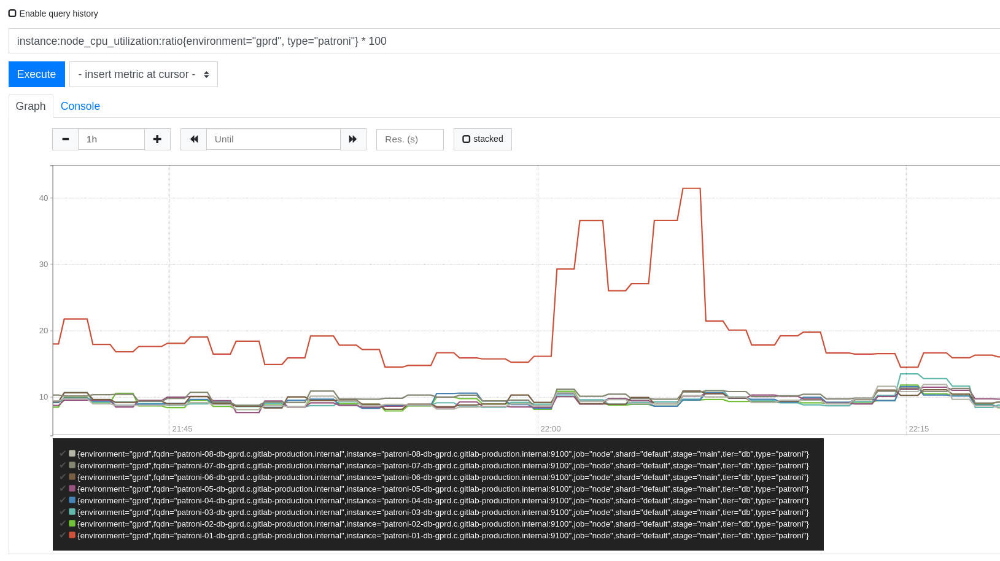
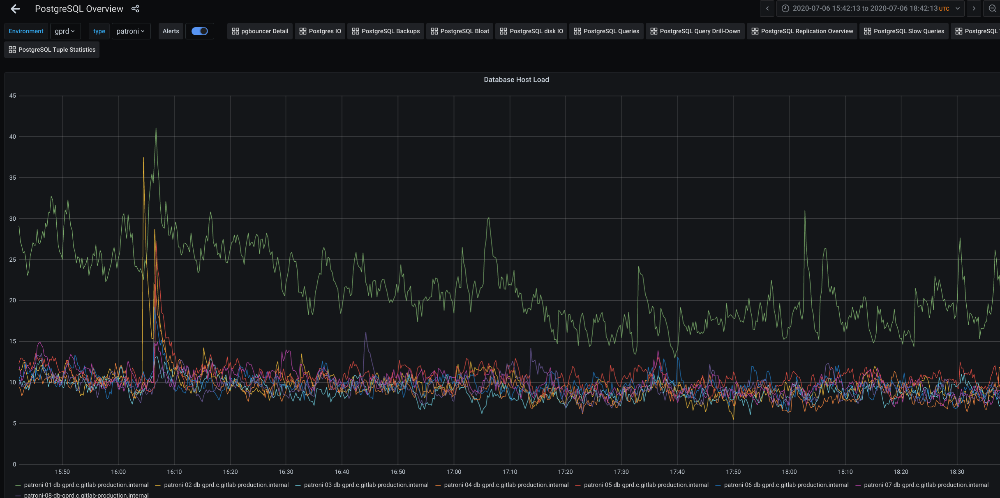
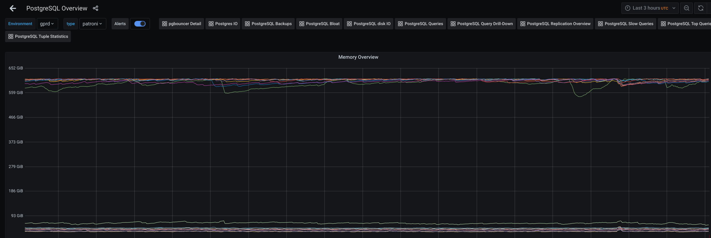
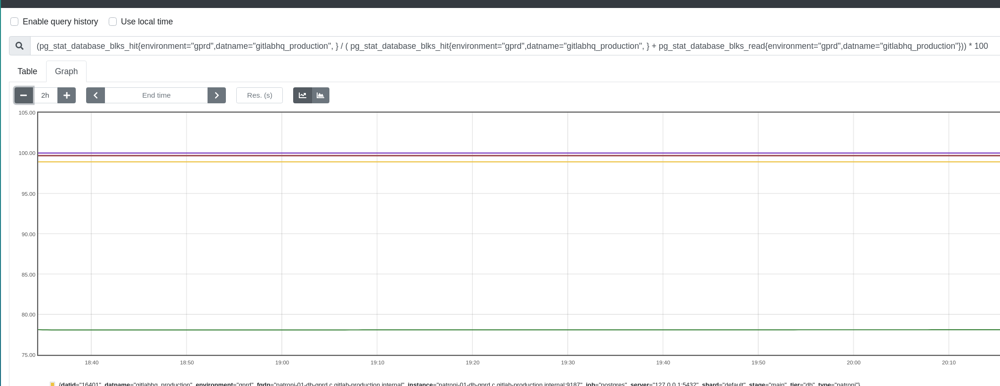
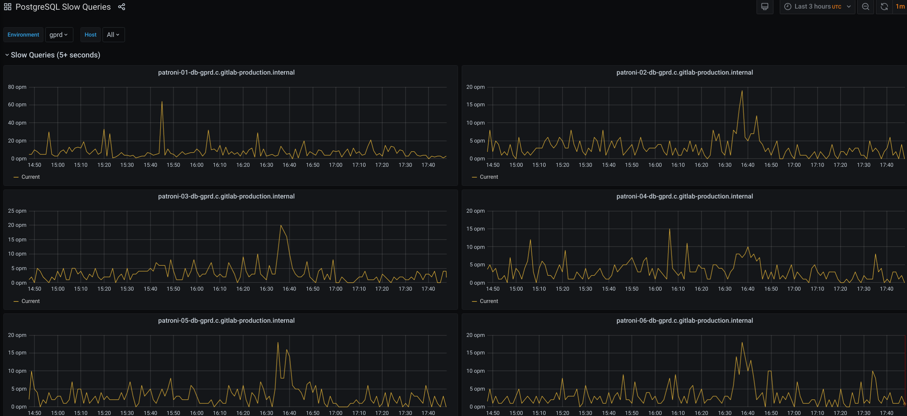
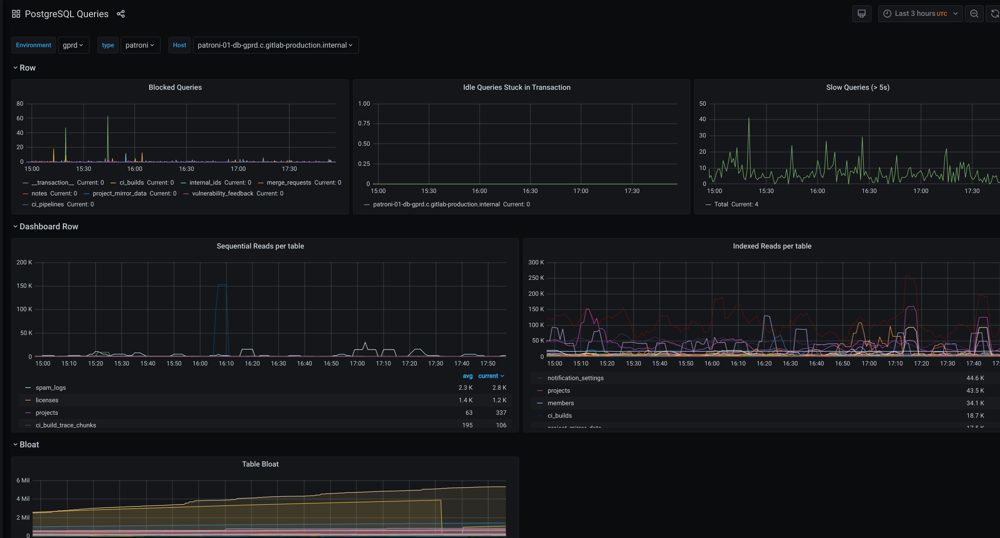

## Troubleshooting database (postgres/pgbouncer) degradation

Database performance degradation may be due to several reasons. To search for de root cause, you can start digging by checking existing metrics.


### Check CPU utilization
You can use [this metric](https://prometheus.gprd.gitlab.net/graph?g0.range_input=1h&g0.expr=instance%3Anode_cpu_utilization%3Aratio%7Benvironment%3D%22gprd%22%2C%20type%3D%22patroni%22%7D%20*%20100&g0.tab=0&g1.range_input=1h&g1.expr=instance_cpu%3Anode_cpu_seconds_not_idle%3Arate1m&g1.tab=0) to check CPU utilization over the patroni hosts:


Check if values are getting close to `1`

You can also take a look on [this graph](https://dashboards.gitlab.com/d/000000144/postgresql-overview?orgId=1&from=1594050133725&to=1594060933725&var-prometheus=Global&var-environment=gprd&var-type=patroni&viewPanel=9) - part of the [Patroni Overview](https://dashboards.gitlab.com/d/000000144/postgresql-overview?orgId=1) panel - to check the host load.



### Check for memory utilization
Check [this graph](https://dashboards.gitlab.com/d/000000144/postgresql-overview?orgId=1&from=now-3h&to=now&var-prometheus=Global&var-environment=gprd&var-type=patroni&viewPanel=12) for an overview of memory utilization:



### Check for Buffer cache utilization
Specially after a failover, a DB repair (indexing, repacking), the cache access pattern can change. With a "cold" cache, query performance may suffer. Check [this graph](https://prometheus-db.gprd.gitlab.net/new/graph?g0.expr=(pg_stat_database_blks_hit%7Benvironment%3D%22gprd%22%2Cdatname%3D%22gitlabhq_production%22%2C%20%7D%20%2F%20(%20pg_stat_database_blks_hit%7Benvironment%3D%22gprd%22%2Cdatname%3D%22gitlabhq_production%22%2C%20%7D%20%2B%20pg_stat_database_blks_read%7Benvironment%3D%22gprd%22%2Cdatname%3D%22gitlabhq_production%22%7D))%20*%20100&g0.tab=0&g0.stacked=0&g0.range_input=2h) to verify the cache hit/read percentaje. Under normal conditions, it should be close to 99%.





### Check for IO saturation
Disk saturation can cause severe service degradation. Check the [PostgreSQL Overview](https://dashboards.gitlab.com/d/000000144/postgresql-overview?orgId=1) dashboard, specially at the following graphs:
- disk IO wait `sdb`
- Disk IO utilization `sdb`
- Retransmit rate (outbound only), resending possibly lost packets

The `sdb` device is the most important to monitor, because it contains the $PGDATA space.

If you need to go deeper, you can log in into the desired instance and use the `iotop` to find out wich process is using most IO:
```sudo iotop -P -a ```

```
Total DISK READ :       0.00 B/s | Total DISK WRITE :       0.00 B/s
Actual DISK READ:       0.00 B/s | Actual DISK WRITE:       0.00 B/s
  PID  PRIO  USER     DISK READ  DISK WRITE  SWAPIN     IO>    COMMAND                                                                                                               
    1 be/4 root          0.00 B      0.00 B  0.00 %  0.00 % systemd --system --deserialize 28
    2 be/4 root          0.00 B      0.00 B  0.00 %  0.00 % [kthreadd]
    4 be/0 root          0.00 B      0.00 B  0.00 %  0.00 % [kworker/0:0H]
24581 be/4 nelsnels      0.00 B      0.00 B  0.00 %  0.00 % [bash]
    6 be/0 root          0.00 B      0.00 B  0.00 %  0.00 % [mm_percpu_wq]
    7 be/4 root          0.00 B      0.00 B  0.00 %  0.00 % [ksoftirqd/0]
    8 be/4 root          0.00 B      0.00 B  0.00 %  0.00 % [rcu_sched]
    9 be/4 root          0.00 B      0.00 B  0.00 %  0.00 % [rcu_bh]
   10 rt/4 root          0.00 B      0.00 B  0.00 %  0.00 % [migration/0]
   11 rt/4 root          0.00 B      0.00 B  0.00 %  0.00 % [watchdog/0]
   12 be/4 root          0.00 B      0.00 B  0.00 %  0.00 % [cpuhp/0]
   13 be/4 root          0.00 B      0.00 B  0.00 %  0.00 % [cpuhp/1]
   14 rt/4 root          0.00 B      0.00 B  0.00 %  0.00 % [watchdog/1]
   15 rt/4 root          0.00 B      0.00 B  0.00 %  0.00 % [migration/1]
   16 be/4 root          0.00 B      0.00 B  0.00 %  0.00 % [ksoftirqd/1]
   18 be/0 root          0.00 B      0.00 B  0.00 %  0.00 % [kworker/1:0H]
   19 be/4 root          0.00 B      0.00 B  0.00 %  0.00 % [cpuhp/2]
   20 rt/4 root          0.00 B      0.00 B  0.00 %  0.00 % [watchdog/2]
```

And if you found an specific `pid` that is using many IO%, you can execute `sudo gitlab-psql` and check what is that pid executing with:

```sql
 SELECT * from pg_stat_activity where pid=<pid from iotop> 
 
```

Disk saturation may also be investigated using _iotop_ tool:

```
# iostat -x 1 3
Linux 4.15.0-1047-gcp (patroni-01-db-gprd) 	07/07/2020 	_x86_64_	(96 CPU)

avg-cpu:  %user   %nice %system %iowait  %steal   %idle
           5.09    0.03    1.83    0.55    0.00   92.51

Device:         rrqm/s   wrqm/s     r/s     w/s    rkB/s    wkB/s avgrq-sz avgqu-sz   await r_await w_await  svctm  %util
loop0             0.00     0.00    0.00    0.00     0.00     0.00     3.20     0.00    0.00    0.00    0.00   0.00   0.00
sdc               0.00     1.65    0.06    0.97     6.09    36.53    82.58     0.00    6.96    5.96    7.03   1.16   0.12
sda               0.00     2.41    1.73    9.70    34.06  1858.20   330.96     0.12   13.27    7.14   14.37   1.38   1.57
sdb               0.00    82.17  566.59 2433.62 23929.43 50266.94    49.46     0.18    0.03    0.34    0.04   0.07  19.55

avg-cpu:  %user   %nice %system %iowait  %steal   %idle
           8.38    0.00    2.48    0.50    0.00   88.63

Device:         rrqm/s   wrqm/s     r/s     w/s    rkB/s    wkB/s avgrq-sz avgqu-sz   await r_await w_await  svctm  %util
loop0             0.00     0.00    0.00    0.00     0.00     0.00     0.00     0.00    0.00    0.00    0.00   0.00   0.00
sdc               0.00    12.00    0.00    7.00     0.00   112.00    32.00     0.00    0.00    0.00    0.00   0.00   0.00
sda               0.00     0.00    0.00   38.00     0.00  9112.00   479.58     0.15    5.37    0.00    5.37   0.74   2.80
sdb               0.00     0.00  490.00 1582.00  4220.00 18576.00    22.00     0.72    0.57    0.66    0.55   0.09  19.60

avg-cpu:  %user   %nice %system %iowait  %steal   %idle
          10.79    0.00    2.52    0.70    0.00   85.99

Device:         rrqm/s   wrqm/s     r/s     w/s    rkB/s    wkB/s avgrq-sz avgqu-sz   await r_await w_await  svctm  %util
loop0             0.00     0.00    0.00    0.00     0.00     0.00     0.00     0.00    0.00    0.00    0.00   0.00   0.00
sdc               0.00     0.00    0.00    0.00     0.00     0.00     0.00     0.00    0.00    0.00    0.00   0.00   0.00
sda               0.00     0.00    0.00    0.00     0.00     0.00     0.00     0.00    0.00    0.00    0.00   0.00   0.00
sdb               0.00   133.00  903.00 1647.00  8180.00 22492.00    24.06     1.21    0.68    0.54    0.76   0.11  27.20
```


### Check for differences in the graphs (same metric, different host)
Load among RO patroni hosts is evenly distributed, so in average, you might expect every metric be similar for every patroni node in the RO ring. When that is not the case, it ussually means that there is some unknown problem with that particular instance, like:
- one patroni instance with much higher replication lag than the rest
- much higher IO usage / io wait than the rest

In general, when those differences are not easy to explain, its because on some issue with GCP, and in most cases that instance/disk must be replaced.


### Check for slow queries

[This board](https://dashboards.gitlab.com/d/000000278/postgresql-slow-queries?orgId=1&refresh=1m) contains information about how many queries took more than 5 seconds.


Check the [PostgreSQL queries](https://dashboards.gitlab.com/d/000000153/postgresql-queries?orgId=1&refresh=1m&from=now-3h&to=now&var-environment=gprd&var-type=patroni&var-fqdn=patroni-01-db-gprd.c.gitlab-production.internal&var-prometheus=Global) board to check for an increasing rate of slow queries (`Slow queries` graph). You can also check for blocked queries (`Blocked Queries` graph). 



For troubleshooting blocked queries, see [this runbook](postgresql-locking.md)


### Checkpoint activity
Checkpoint is the act of pushing all the write buffers to disk. A sudden increase of write activity (like indexing, repacking, etc) may also increase the rate of checkpoints, and can cause the system to slow down. You can see [this graph](https://dashboards.gitlab.com/d/000000224/postgresql-bloat?viewPanel=35&orgId=1&refresh=5m&from=now-1h&to=now) to see how often checkpoints are taking place. Focus on the current leader. If checkpoints do ocurr too often (more than [checkpoint_warning](https://postgresqlco.nf/en/doc/param/checkpoint_warning/11/)) you will see a message in the logs, similar to

``` LOG:  checkpoints are occurring too frequently (8 seconds apart) ```

Althoug this is more like a warning message, it can be OK under heavy write activity. 


### Check the load from queries
Too much concurrent activity can affect performance. Refer to [this runbook](postgresql-query-load-evaluation.md) to evaluate server activity.


### Checks for pgBouncer

#### Waiting clients
The [PgBouncer Overview](https://dashboards.gitlab.com/d/PwlB97Jmk/pgbouncer-overview?orgId=1&from=now-3h&to=now) shows pgBouncer related information. 


When troubleshooting, check that:
- if `Waiting Client Connections per Pool` is  consistenly high, it may be related to slow queries taking most available connections in the pool, so others have to wait. Refer to [this runbook](postgresql-query-load-evaluation.md) to evaluate server activity.

- if `Connection Saturation per Pool` is consistenly close to 100%, probably the database is not able to keep up the requests. Refer to [this runbook](postgresql-query-load-evaluation.md) to evaluate server activity.

- PgBouncer is single threaded. That means that a single core will do most of the job. If `pgbouncer Single Threaded CPU Saturation per Node
` is consistently close to 100%, performance of pgBouncer will decrease. You can use the `SHOW CLIENTS` command to check where the clients are connecting from for a start:

```
:~$ sudo pgb-console 
psql (11.7 (Ubuntu 11.7-2.pgdg16.04+1), server 1.12.0/bouncer)
Type "help" for help.

pgbouncer=# show clients;

 type |   user    |      database       | state  |     addr     | port  | local_addr | local_port |      connect_time       |      request_time       |  wait  | wait_us | close_needed |      ptr       |   link   | remote_pid | tls 
------+-----------+---------------------+--------+--------------+-------+------------+------------+-------------------------+-------------------------+--------+---------+--------------+----------------+----------+------------+-----
 C    | gitlab    | gitlabhq_production | active | 10.218.5.2   | 35140 | 10.217.4.5 |       6432 | 2020-07-03 10:59:50 UTC | 2020-07-03 12:46:38 UTC |      0 |       0 |            0 | 0x7fefc1d29880 |          |          0 | 
 C    | gitlab    | gitlabhq_production | active | 10.220.4.33  | 43228 | 10.217.4.5 |       6432 | 2020-07-07 18:25:01 UTC | 2020-07-07 19:32:06 UTC |      0 |       0 |            0 | 0x7fefc1d48270 |          |          0 | 
 C    | gitlab    | gitlabhq_production | active | 10.220.8.9   | 48214 | 10.217.4.5 |       6432 | 2020-07-07 18:25:59 UTC | 2020-07-07 19:31:28 UTC |      0 |       0 |            0 | 0xee0ed8       |          |          0 | 
 C    | gitlab    | gitlabhq_production | active | 10.220.8.12  | 56232 | 10.217.4.5 |       6432 | 2020-07-07 18:26:00 UTC | 2020-07-07 19:32:24 UTC |      0 |       0 |            0 | 0x7fefc1d48ad0 |          |          0 | 
 C    | gitlab    | gitlabhq_production | active | 10.220.9.209 | 36196 | 10.217.4.5 |       6432 | 2020-07-07 18:26:47 UTC | 2020-07-07 19:32:36 UTC |      0 |       0 |            0 | 0x7fefc1ce6df8 |          |          0 | 
 C    | gitlab    | gitlabhq_production | active | 10.220.4.33  | 33986 | 10.217.4.5 |       6432 | 2020-07-07 18:26:51 UTC | 2020-07-07 19:32:38 UTC |      0 |       0 |            0 | 0x7fefc1d43928 |          |          0 | 
 C    | gitlab    | gitlabhq_production | active | 10.220.8.6   | 46466 | 10.217.4.5 |       6432 | 2020-07-07 18:27:34 UTC | 2020-07-07 19:31:48 UTC |      0 |       0 |            0 | 0x7fefc1d47e40 |          |          0 | 
 C    | gitlab    | gitlabhq_production | active | 10.218.5.2   | 57862 | 10.217.4.5 |       6432 | 2020-07-07 18:27:44 UTC | 2020-07-07 18:27:44 UTC |      0 |       0 |           
```
