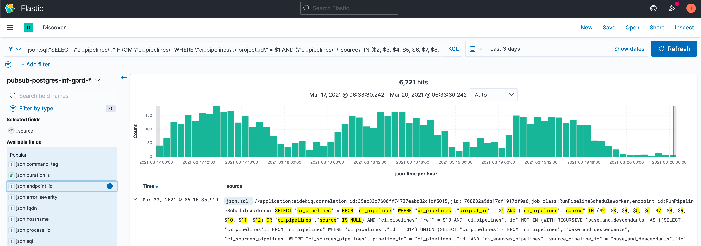
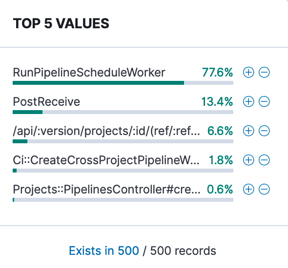

## The goal of this runbook is collect the info to fulfill the (form)[https://gitlab.com/gitlab-org/gitlab/-/issues/new?issuable_template=Query%20Performance%20Investigation] for a SQL query investigation. 

We need to gather the following information:

- QPS - Queries per second.
- Duration
- Source of calls (Sidekiq, WebAPI, etc)
- Query ID
- SQL Statement
- Query Plan
- Query Example
- Total number of calls (relative)
- % of Total time

Considering as an example, we are gathering info for the following statement: 'SELECT "users".* FROM "users" INNER JOIN "project_authorizations" ON "users"."id" = "project_authorizations"."user_id" WHERE "project_authorizations"."project_id" = $1%'

We have the info of the:

- SQL Statement: 'SELECT "users".* FROM "users" INNER JOIN "project_authorizations" ON "users"."id" = "project_authorizations"."user_id" WHERE "project_authorizations"."project_id" = $1%'


## Collecting info from pg_stat_statements:


- We will gather the following info from pg_stat_statements with the query:


```
SELECT
  queryid, 
  calls, 
  total_time, 
  mean_time, 
  query 
FROM 
  pg_stat_statements 
WHERE 
  query like '%SELECT "users".* FROM "users" INNER JOIN "project_authorizations" ON "users"."id" = "project_authorizations"."user_id" WHERE "project_authorizations"."project_id" = $1%' ;

```

The output is:

```
-[ RECORD 1 ]-----------------------------------------------------------------------------------------------------------------------------------------------------------------------------------------------------------------------
queryid     | -6386890822646776524
calls       | 80523859
total_time  | 1245866438.33135
mean_time   | 26.659849185085
query       | SELECT "users".* FROM "users" INNER JOIN "project_authorizations" ON "users"."id" = "project_authorizations"."user_id" WHERE "project_authorizations"."project_id" = $1 /*application:web,correlation_id:1UUb7KNTS51*/

```

- Duration : 26.659849185085
- Source of calls : Web-API  ( due to the analysis on the marginalia comment: /*application:web,correlation_id:1UUb7KNTS51*/)
- Query ID : -6386890822646776524

- Total number of calls : 80523859
- % of Total time : 1245866438.33135 ( I am adding here the total time) the % we would need to check in Postgres checkup.


We are still missing the following fields: 

- QPS
- Query Plan
- Query Example 

## Collecting parameters from the PostgreSQL logs

To execute an analyze we need to have the correct values from the parameters. In case of our example we need to gather 1 parameter the $1 from the SQL statement.

In this case we need to query the PostgreSQL logs where the query is executed. Due to the setup of the parameter `log_min_duration_statement` we log all the queries that ran for at least 1 second. 

We recommend to copy locally the logs and do not leave extra copies on the host. Consider the postgresql.csv the PostgreSQL log file.

Execute the following grep:

`grep "SELECT \"\"users\"\".* FROM \"\"users\"\" INNER JOIN \"\"project_authorizations\"\" ON \"\"users\"\".\"\"id\"\" = \"\"project_authorizations\"\"" postgresql.csv`

The output is:

```
2021-02-16 08:37:14.855 GMT,"gitlab","gitlabhq_production",67790,"10.217.8.4:49338",602b788c.108ce,32,"SELECT",2021-02-16 07:47:24 GMT,10/1963268940,0,LOG,00000,"duration: 1560.237 ms  execute <unnamed>: /*application:sidekiq,correlation_id:01EYMZRVEV329ZZK5B1VE41QKQ,jid:0c6f40b156bec305b1080cac,job_class:PipelineNotificationWorker*/ SELECT ""users"".* FROM ""users"" INNER JOIN ""project_authorizations"" ON ""users"".""id"" = ""project_authorizations"".""user_id"" WHERE ""project_authorizations"".""project_id"" = 23782237",,,,,,,,,""
2021-02-16 09:57:02.645 GMT,"gitlab","gitlabhq_production",37639,"10.217.8.4:52702",602b9200.9307,10,"SELECT",2021-02-16 09:36:00 GMT,265/98696440,0,LOG,00000,"duration: 1078.484 ms  execute <unnamed>: /*application:sidekiq,correlation_id:01EYN4B30QRYM1PPWP7FADHGQM,jid:44ba77e77db34ae24fe48709,job_class:PipelineNotificationWorker*/ SELECT ""users"".* FROM ""users"" INNER JOIN ""project_authorizations"" ON ""users"".""id"" = ""project_authorizations"".""user_id"" WHERE ""project_authorizations"".""project_id"" = 20500591",,,,,,,,,""
```

Where we can identify 2 values as the possible values for project_id that is our parameter: 23782237 or 20500591.


Now we have the query example: 

to clean the `"` from the sql string, we can execute :

```
echo 'SELECT "users".* FROM "users" INNER JOIN "project_authorizations" ON "users"."id" = "project_authorizations"."user_id" WHERE "project_authorizations"."project_id"' | sed 's/"//g'

```

The output is:
```
SELECT users.* FROM users INNER JOIN project_authorizations ON users.id = project_authorizations.user_id WHERE project_authorizations.project_id
```

Query example : `SELECT users.* FROM users INNER JOIN project_authorizations ON users.id = project_authorizations.user_id WHERE project_authorizations.project_id = 20500591;`

And to gather the info about the Query plan we need to add an EXPLAIN on the query example, and execute on the database: 


Query plan: 
```
gitlabhq_production=# EXPLAIN SELECT users.* FROM users INNER JOIN project_authorizations ON users.id = project_authorizations.user_id WHERE project_authorizations.project_id = 20500591;
                                                       QUERY PLAN
-------------------------------------------------------------------------------------------------------------------------
 Gather  (cost=1027.14..7761.32 rows=1824 width=1283)
   Workers Planned: 1
   ->  Nested Loop  (cost=27.14..6578.92 rows=1073 width=1283)
         ->  Parallel Bitmap Heap Scan on project_authorizations  (cost=26.71..2916.78 rows=1073 width=4)
               Recheck Cond: (project_id = 20500591)
               ->  Bitmap Index Scan on index_project_authorizations_on_project_id  (cost=0.00..26.25 rows=1824 width=0)
                     Index Cond: (project_id = 20500591)
         ->  Index Scan using users_pkey on users  (cost=0.43..3.41 rows=1 width=1283)
               Index Cond: (id = project_authorizations.user_id)
```

Another interesting step is to evaluate the access plan on https://explain.depesz.com and share in the template.

## Collecting most commonly sources from Elasticsearch

If you do not have direct access to the PostgreSQL CSV logs, you can
still use Elasticsearch to determine the most common endpoints that
originated the slow SQL statements in question. PostgreSQL slow logs are
indexed in Elasticsearch, and there are a number of key fields:

1. `json.sql`: The normalized SQL query stripped of all
parameters. Parameters are substituted with `$1`, `$2`, `$3`, etc.
Marginalia comments are also stripped and parsed into structured fields (e.g. `application_name`, `endpoint_id`, etc.).
1. `json.fingerprint`: A unique hash value for a given SQL query. This makes it easier to see how often the same query appears.
1. `json.duration_s`: The time in seconds that this SQL query took.
1. `json.endpoint_id`: The Rails controller and action
(e.g. `ProjectsController#index`), API call (`/api/v4/jobs/request`), or
Sidekiq job (e.g. `PostReceive`) responsible for that SQL query.
1. `json.hostname`: The name of the PostgreSQL host that served the query (e.g. `patroni-01`, `patroni-02`, etc.).

You can search for matching hits via:

1. Go to [https://log.gprd.gitlab.net](https://log.gprd.gitlab.net).
1. On the left-hand dropdown, switch to the `pubsub-postgres-inf-gprd-*` index.
1. Click `Add filter`, select `json.sql`, and enter in part or all of the SQL query to match.

For example, [in this issue](https://gitlab.com/gitlab-org/gitlab/-/issues/325338), we can use
Kibana to search for part of this SQL. https://log.gprd.gitlab.net/goto/874aac0ee2ceba629e5f2a62d2f00bf5
shows:



Clicking on the `json.endpoint_id` in the `Available fields` section
gives a quick breakdown of the last 500 records:



Here we can see `RunPipelineScheduleWorker` and `PostReceive` Sidekiq
jobs appear to be the main originators of this SQL query. You may want
to plot the data by total count or sum by `duration_s` in Kibana's `Visualize` to confirm.

If you want to filter queries that only ran on the primary, you will
need to know the hostname for the primary at the time. You can obtain
the current primary via the `pg_replication_is_replica` Prometheus
metric. The value 1 means the host was a replica, while 0 means it was a primary.
This [Grafana dashboard](https://dashboards.gitlab.net/d/000000244/postgresql-replication-overview?orgId=1)
plots this field over time.

## Collecting QPS info from Thanos

QPS: to gather the QPS we need to execute the following thanos query: 

https://thanos-query.ops.gitlab.net/graph?g0.range_input=6h&g0.end_input=2021-02-17%2013%3A36&g0.step_input=3&g0.moment_input=2021-02-01%2011%3A00%3A00&g0.max_source_resolution=0s&g0.expr=sum(rate(%20pg_stat_statements_calls%7Bqueryid%3D%22-6386890822646776524%22%2C%20env%3D%22gprd%22%2C%20monitor%3D%22db%22%2C%20type%3D%22patroni%22%2Cinstance%3D%22patroni-03-db-gprd.c.gitlab-production.internal%3A9187%22%7D%5B5m%5D))&g0.tab=0

Please remember to change the queryId and update the timeframe:

Example of Thanos query: `sum(rate( pg_stat_statements_calls{queryid="-6386890822646776524", env="gprd", monitor="db", type="patroni",instance="patroni-03-db-gprd.c.gitlab-production.internal:9187"}[5m]))`

QPS: between 35 and 45