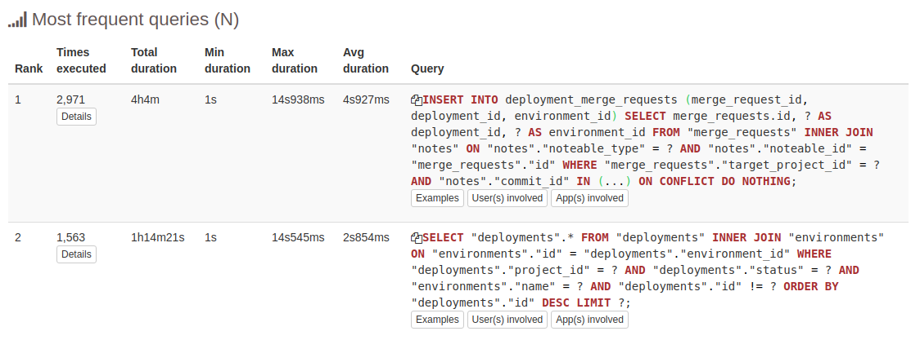
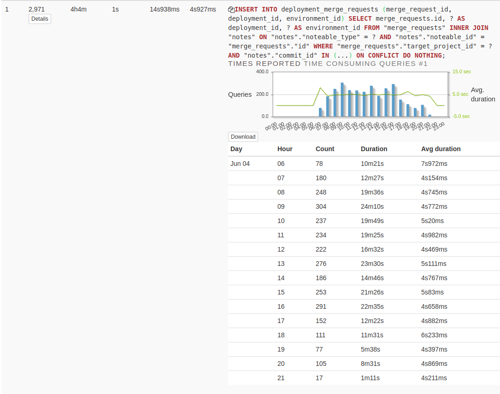
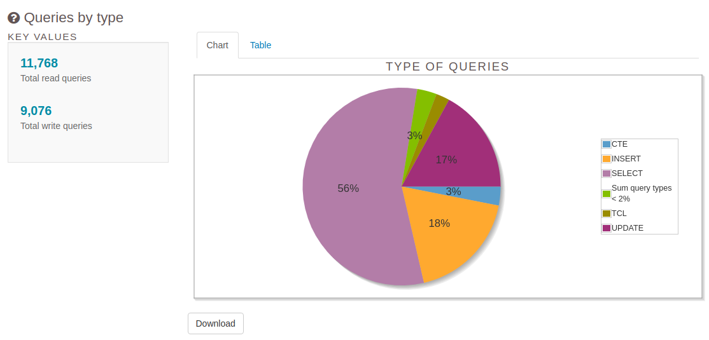
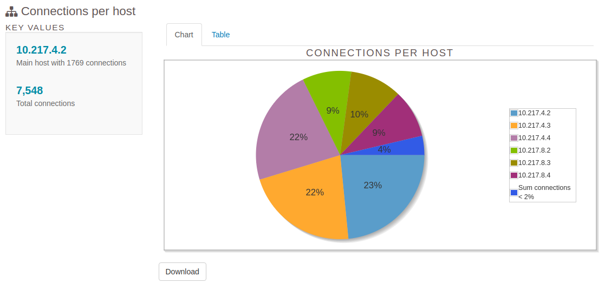
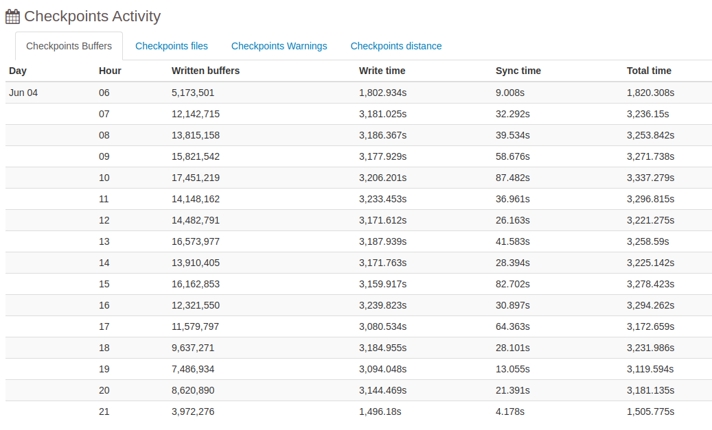
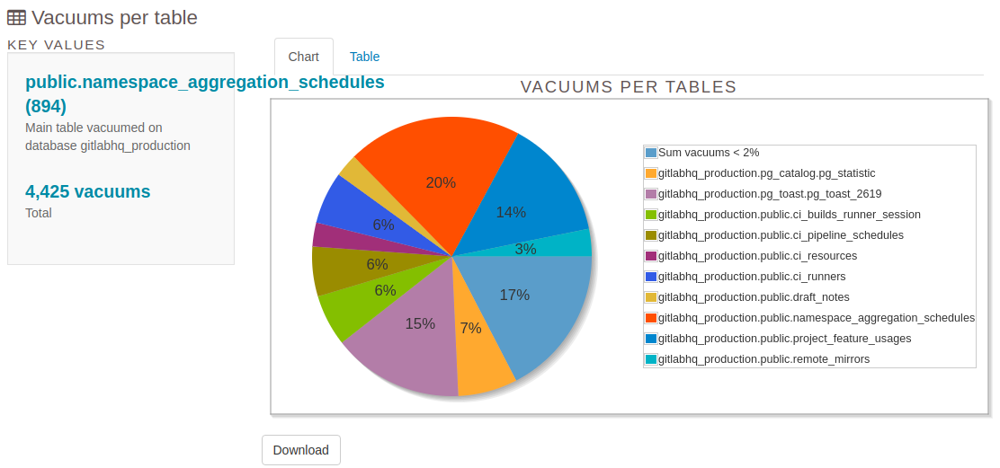

# pgbadger Runbook

<<<<<<< HEAD
=======
Here the link to the video of the [runbook simulation](https://youtu.be/yUwaWMUJyS4).

>>>>>>> 92075026c4a206bf585c9b662de841e3f6babb50
## Intro
[pgbadger](https://github.com/darold/pgbadger) is a free  tool that can help to generate a fast interactive HTML report from PostgreSQL's logs, it is very useful when you want to analyze logs with a lot of info. 
The report from pgbadger is about queries (it is always logged when the query time is greater than [log_min_duration_statement](https://postgresqlco.nf/en/doc/param/log_min_duration_statement/) parameter ), connections, vacuum, lock,  errors and others stuff


## Use in GitLab

The first step is to detect the values of two PostgreSQL's parameters, in case of GitLab are the following:

```
show log_destination;
 log_destination 
-----------------
 csvlog
(1 row)

show log_line_prefix;
                   log_line_prefix                   
-----------------------------------------------------
 %m [%p, %x]: [%l-1] user=%u,db=%d,app=%a,client=%h 

```

The following flags of pgbadger to analyze logs are depending on the previous result:

```
--format csv
--prefix '%m [%p, %x]: [%l-1] user=%u,db=%d,app=%a,client=%h'
--csv-separator ','
```

Example of use:
The GitLab postgreSQL's log are located in /var/log/gitlab/postgresql

```
#copy log files from DB server
scp -F ~/.ssh/ssh-file patroni-N-db-gprd.c.gitlab-production.internal:/var/log/gitlab/postgresql/postgresql.cs* .

###If not have permission with your user, can copy to your home and then copy scp command or can streaming via `ssh`:

# zip files (zcat)
 ssh -F ~/.ssh/ssh-file patroni-N-db-gprd.c.gitlab-production.internal "sudo zcat /var/log/gitlab/postgresql/postgresql.csv.3.gz" > postgresql.csv.3
 # plain files (cat)
 ssh -F ~/.ssh/ssh-file patroni-N-db-gprd.c.gitlab-production.internal "sudo cat /var/log/gitlab/postgresql/postgresql.csv" > postgresql.csv

# analyzing 1 log file, but you can analyze more passing the names at the end
pgbadger --format csv --prefix '%m [%p, %x]: [%l-1] user=%u,db=%d,app=%a,client=%h' -o log_report.html --csv-separator ',' postgresql.csv.1

```

The output report will be in html file named `log_report.html`

## The highlighted sections of the report


###  **Queries reports:**

 ### Top 
 The top tab, is one of the most important tabs, and  show the information about slowest queries  found in the logs, see the sections called:
  * Time consuming queries
  * Most frequent queries
  


If make Click the button `Details ` will see more info about this query related with count and duration



 ### Queries
 The Queries tab show the statistical information about queries found in the logs, see the sections called:
  * Queries by type
  * Queries by host



### **General reports**

### Overview
The overview tab shows some general statistical information, see the sections called:

* Global stats 
* General Activity


### Connections
The connections tab shows the graphs about connection information found in the logs, see the sections called:
* Connections per user
* Connections per host




###  **Write reports:**

### Checkpoints
 The checkpoints tab show the statistical information about the checkpoint process found in the logs, see the section called:
  `Checkpoints Activity` 




 ### Vacuums
 The vacuums tab shows the information about VACUUMs and ANALYZEs occurring in the database found in the logs, see the sections called:
  * Analyzes per table 
  * Vacuums per table 
  * Autovacuum Activity




###  **Locks and Events reports:**

 ### locks
 The locks tab show the information about locks occurring in the database found in the logs, see all section here


 ### Events
 The events tab show the anything information no show in another tabs, see the section called:
  *  Most Frequent Errors/Events
  
<<<<<<< HEAD


## Creating a partial report
The postgreSQL logfile can grow very large. If you need a report for a portion of what is in the logfile, you can use the `--begin` and `--end` to define an specific timeframe:

``` pgbadger --prefix '%m [%p, %x]: [%l-1] user=%u,db=%d,app=%a,client=%h' --begin="2020-06-30 13:00:00" --end="2020-06-30 15:00:00"  -o report.html postgresql.csv ```

_Dont forget to add the seconds, or you will get an error_


## Creating incremental (daily and weekly) reports

PgBadger can create incrememental reports. When using the `-I` option, report destination must be a directory (`-O` option). PgBadger will automatically create an index for you to browse the daily reports. It will also cleanup "old" reports by specifying the `--retention <weeks>` option:


``` mkdir -p /var/www/pgbadger-reports && pgbadger -I -O /var/www/pgbadger-reports/ --retention 4 --prefix '%m [%p, %x]: [%l-1] user=%u,db=%d,app=%a,client=%h' postgresql.csv ```

This will create an browseable index:


So the next executions (with a new logfile) will update the index, and you will be able to pick any day, or check the weekly report on mondays.
=======

>>>>>>> 92075026c4a206bf585c9b662de841e3f6babb50
