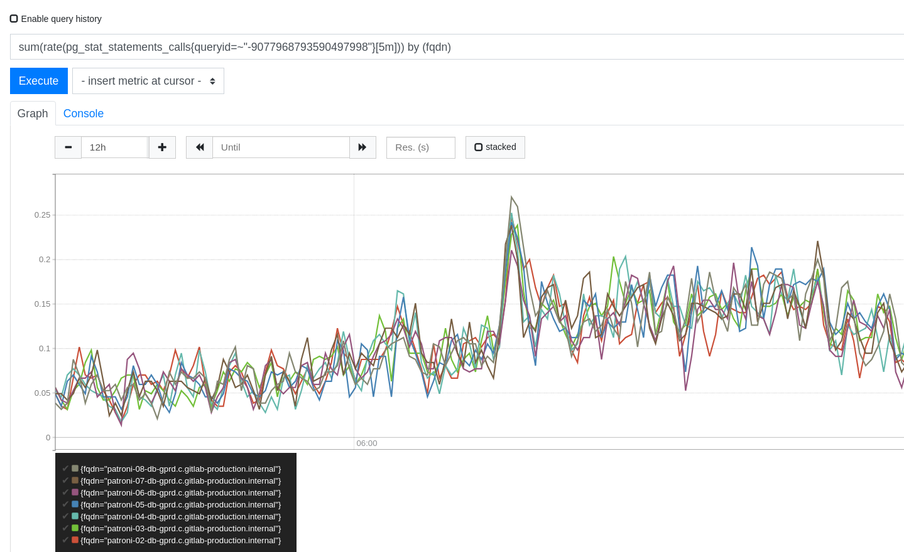

# How to evaluate load from queries

## Introduction

PostgreSQL supports a high level of concurrency by implementing what is called [MVCC](https://www.postgresql.org/docs/11/mvcc-intro.html), or `M`ulti`v`ersion `C`oncurrency `C`ontrol, to allow multiple transactions to read (and possibly update) the very same data, and yet providing full [ACID compilance](https://en.wikipedia.org/wiki/ACID) for every transaction.

High degree of concurrency can make one or more (or every) node to be under heavy load. This runbook is for searching specific queries that may be the source of the slowness.

### How to see current activity

The main source of information is the [pg_stat_activity](https://www.postgresql.org/docs/11/monitoring-stats.html#PG-STAT-ACTIVITY-VIEW) system view. It contains a lot of information about what is currently connected to the database. The most commonly used columns are:

- application_name: Application depending. It helps to identify wich application is executing the current query
- query_start: shows the start of query execution. Used with now() can provide the "age" of this query.
- state: Probably the most common column for filtering and grouping. Most common values are "active" and "idle .*"
- wait_event_type and wait_event: Work together to provide information about the event this backed is waiting to happen (if any). `Lock` event type refers to _heavyweight_ locks, and we have to pay attention to that. (*)
- query: It contains the query being executed (or the last query executed, depending on the `state` column)
- client_addr: Contains the client ip address (in the leader, this points to the corresponding pgBouncer node)

(*) You can refer to the [locking runbook](postgresql-locking.md) for more information about how to track locking activity.

### See total amount of connections

```sql
select count(*) from pg_stat_activity;
```

When troubleshooting, is usually used with grouping:

`pg_stat_activity.state` can be in several different states. The main states are:

- Active: The backend is actively executing the query.
- Idle: The backend is waiting for a command to execute.
- Idle in transaction: The backend is inside a transaction, but not currently executing a query.
- Idle in transaction (aborted): Similar to the previous one, but an SQL statement caused an error.

### Summary of states

```sql
select state, count(*) from pg_stat_activity group by 1;
```

```
gitlabhq_production=# select state, count(*) from pg_stat_activity group by 1;
 state  | count
--------+-------
        |     4
 active |    11
 idle   |    37
(3 rows)


```

Sometimes you want to quantify how many "old" queries are being currently executed (lets say, for more that one second):

```sql
select count(*) from pg_stat_activity where state='active' and now() - query_start >= interval '1 second';
```

```
gitlabhq_production=# select count(*) from pg_stat_activity where state='active' and now() - query_start >= interval '1 second';
 count
-------
     3
(1 row)

```

### Top 5 oldest _active_ queries

```sql
select application_name, query, now() - query_start as query_age from pg_stat_activity where state='active' order by 3 desc limit 5
```

### pgBouncer workload (leader only)

Shows the distribution of incoming connections (mostly corresponding to the pgBouncer instances)

```sql
select client_addr, count(*) from pg_stat_activity where state='active' group by 1 order by 2 desc;
```

### Database load distribution (by query)

This query is an attempt to "generalize" the contents of `pg_stat_activity.query`, when you want to see how often a query is being executed, without taking care of query parameters:

```sql
select regexp_replace(regexp_replace( regexp_replace(query,'\m[0-9]+\M','?','g')  , E'''[^'']+''', '?', 'g'), '\/\*.*\*\/', '') query, count(*) from pg_stat_activity
group by 1
order by 2 desc
limit 5;
```

```
                                  query                                    | count
----------------------------------------------------------------------------+-------
                                                                            |     9
 SELECT username, password FROM public.pg_shadow_lookup($?)                 |     6
 SELECT "projects".* FROM "projects" WHERE "projects"."id" = ? LIMIT ?      |     4
 SELECT "licenses".* FROM "licenses" ORDER BY "licenses"."id" DESC LIMIT ?  |     4
 SELECT ?                                                                   |     4
(5 rows)
```

### Using `pg_stat_statements` as source of information

The [pg_stat_statement extension](https://www.postgresql.org/docs/11/pgstatstatements.html) provides information for tracking execution of queries in a PostgreSQL instance.

Watching the outputs of `pg_stat_statements` can be helpful. Query body is shown in their "generalized" form (without providing information about query parameters). Depending on how you want to focus your investigation, the following pg_stat_statements columns can be used for sorting (usually in reverse order):

- calls
- total_time
- mean_time
- rows

For clarity, the query text is being truncated:

```sql

select queryid, substr(query, 1, 50), calls, total_time, min_time, max_time, mean_time,rows from pg_stat_statements order by calls desc limit 5;

```

```
       queryid        |                       substr                       |   calls    | total_time  | min_time | max_time | meantime |    rows
----------------------+----------------------------------------------------+------------+-------------+----------+----------+----------+------------
   833913155023572892 | SELECT $1                                          | 3719787524 | 10023670.69 |     0.00 |    24.98 |     0.00 | 3719787524
 -2598210124401935501 | SELECT "licenses".* FROM "licenses" ORDER BY "lice | 1964360578 | 37747205.12 |     0.01 |  3728.41 |     0.02 | 9595904226
  6769309683899657633 | SELECT "routes".* FROM "routes" WHERE "routes"."so | 1883312853 | 61063360.62 |     0.01 | 12123.87 |     0.03 | 1883252244
 -4035297434153764901 | SELECT MAX("project_authorizations"."access_level" | 1424064577 | 51434341.43 |     0.01 | 12144.48 |     0.04 | 1407067606
 -1551638630325076753 | SELECT "project_features".* FROM "project_features | 1315909766 | 37068040.91 |     0.01 | 11780.99 |     0.03 | 1315909766


```

__Note: pg_stat_statements information is most useful for troubleshooting when the age of his content is fresh enough. As there is not easy way to say when this statistics have been reset, you may want to use the `pg_stat_statements_reset()` function to do so (you have to reset every host separately!)__

### Statements are tracked by Prometheus

In [Prometheus](https://prometheus-db.gprd.gitlab.net/) an specific query can be tracked back in time, to see if there is any disruptions or abnormalities in `calls`, `rows`, or `time`, like in this example:



Different metrics can be used to refer `pg_stat_statements` from the _calls_, _seconds_total_ or _rows_ columns, by executing queries like those:

- sum(rate(pg_stat_statements_calls{queryid=~"--queryid--"}[5m])) by (fqdn)
- sum(rate(pg_stat_statements_seconds_total{queryid=~"--queryid--"}[5m])) by (fqdn)
- sum(rate(pg_stat_statements_rows{queryid=~"--queryid--"}[5m])) by (fqdn)

So, if you see an spike on the "calls", that could point to a sudden raise of traffic (and futher analysis could be made based on that).

If you see a raise on the "seconds total" column that does not correspond to a raise of "calls" for the same queryid, then that query might be underperforming for some reason (an index migth have been dropped, old statistics and so on)
