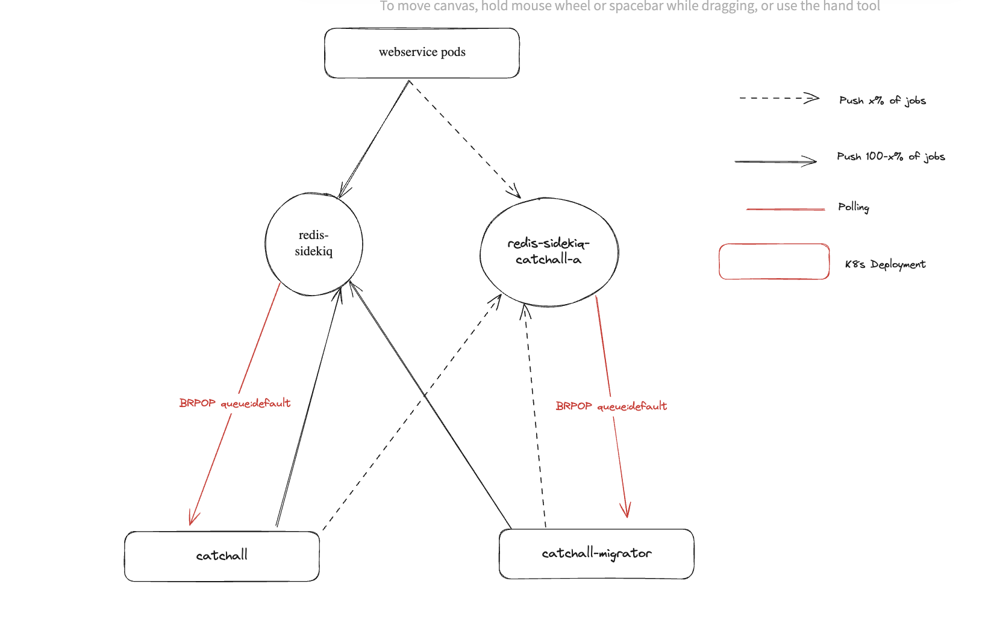

## Sidekiq Sharding

This documents outlines the necessary steps to horizontally shard Sidekiq and migrate workloads to the new Redis instance.

### Background

Sidekiq uses a Redis instance as its backing datastore. However, Redis is not horizontally scalable and Redis Cluster is not suitable for Sidekiq since
there are only a small subset of hot keys.

[Sharding](https://github.com/sidekiq/sidekiq/wiki/Sharding) Sidekiq involves routing jobs to another Redis at the application level.

Gitlab Rails supports this using an application-layer router which was implemented as part of [epic 1218](https://gitlab.com/groups/gitlab-com/gl-infra/-/epics/1218)

Note that "shard" in this document is different from "shard" in the context of [K8s deployments](creating-a-shard.md)

#### Sharding



The routing rules will specify how jobs are to be routed. For instance below, the last routing rule will
route jobs to the `queues_shard_catchall_a` instance in the `config/redis.yml`.
All other jobs will be routed to the main Sidekiq Redis defined by `config/redis.queues.yml` or the `queues` key in `config/redis.yml`.

```
sidekiq:
  routingRules:
    - ["worker_name=AuthorizedProjectUpdate::UserRefreshFromReplicaWorker,AuthorizedProjectUpdate::UserRefreshWithLowUrgencyWorker", "quarantine"] # move this to the quarantine shard
    - ["worker_name=AuthorizedProjectsWorker", "urgent_authorized_projects"] # urgent-authorized-projects
    - ["resource_boundary=cpu&urgency=high", "urgent_cpu_bound"] # urgent-cpu-bound
    - ["resource_boundary=memory", "memory_bound"] # memory-bound
    - ["feature_category=global_search&urgency=throttled", "elasticsearch"] # elasticsearch
    - ["resource_boundary!=cpu&urgency=high", "urgent_other"] # urgent-other
    - ["resource_boundary=cpu&urgency=default,low", "low_urgency_cpu_bound"] # low-urgency-cpu-bound
    - ["feature_category=database&urgency=throttled", "database_throttled"] # database-throttled
    - ["feature_category=gitaly&urgency=throttled", "gitaly_throttled"] # gitaly-throttled
    - ["*", "default", "queues_shard_catchall_a"] # catchall on k8s
```

To configure the Sidekiq server to poll from `queues_shard_catchall_a`, define an environment `SIDEKIQ_SHARD_NAME: "queues_shard_catchall_a"` in `extraEnv` of the desired [Sidekiq deployment](https://gitlab.com/gitlab-com/gl-infra/k8s-workloads/gitlab-com/-/blob/master/releases/gitlab/values/gstg.yaml.gotmpl) under `sidekiq.pods`.

The routing can be controlled using a feature flag `sidekiq_route_to_<queues_shard_catchall_a or any relevant shard name>` and "pinned" using the `SIDEKIQ_MIGRATED_SHARDS` environment variable post-migration.

#### Migration Overview

1. Configuring the Rails app and chef VMs.

This involves updating the routing rules by specifying a Redis instance in the rule. Note that the particular instance needs to be configured in `config/redis.yml`.

Refer to [a previous change issue](https://gitlab.com/gitlab-com/gl-infra/production/-/issues/17787) for an example of executing this change.

2. Provision a temporary migration K8s deployment

During the migration phase, 2 separate set of K8s pods are needed to poll from 2 Redis instances (migration source and migration target). This ensures that there are no unprocessed jobs that are not polled from a queue.

A temporary Sidekiq deployment needs to be added in [k8s-workloads/gitlab-com](https://gitlab.com/gitlab-com/gl-infra/k8s-workloads/gitlab-com/-/blob/master/releases/gitlab/values/gstg.yaml.gotmpl) under `sidekiq.pods`. The temporary deployment needs to have `SIDEKIQ_SHARD_NAME: "<new redis instance name>"` defined as an extra environment variable to correctly configure the `Sidekiq.redis`.

Below is an example. Note that variables like `maxReplicas`,  `resources.requests`, `resources.limits` may need to be tuned depending on the state of gitlab.com at the point of migration. `queues` and `extraEnv` would need to be updated to be relevant to the migration.

 ```
pods:
  - name: catchall-migrator
    common:
      labels:
        shard: catchall-migrator
    concurrency: 10
    minReplicas: 1
    maxReplicas: 100
    podLabels:
      deployment: sidekiq-catchall
      shard: catchall-migrator
    queues: default,mailers
    resources:
      requests:
        cpu: 800m
        memory: 2G
      limits:
        cpu: 1.5
        memory: 4G
    extraEnv:
      GITLAB_SENTRY_EXTRA_TAGS: "{\"type\": \"sidekiq\", \"stage\": \"main\", \"shard\": \"catchall\"}"
      SIDEKIQ_SHARD_NAME: "queues_shard_catchall_a"
    extraVolumeMounts: |
      - name: sidekiq-shared
        mountPath: /srv/gitlab/shared
        readOnly: false
    extraVolumes: |
      # This is needed because of https://gitlab.com/gitlab-org/gitlab/-/issues/330317
      # where temp files are written to `/srv/gitlab/shared`
      - name: sidekiq-shared
        emptyDir:
          sizeLimit: 10G
```

Refer to [a previous change issue](https://gitlab.com/gitlab-com/gl-infra/production/-/issues/17787) for an example of executing this change.

3. Gradually toggle feature flag to divert traffic

Use the following chatops command to gradually increase the percentage of time which the feature flag is `true`.

```
chatops run feature set sidekiq_route_to_queues_shard_catchall_a 50 --random --ignore-random-deprecation-check
```

Refer to [a previous change issue](https://gitlab.com/gitlab-com/gl-infra/production/-/issues/17841) for an example of a past migration. The proportion of jobs being completed by the new deployment will increase with the feature flag's enabled percentage.

The migration can be considered completed after the feature flag is fully enabled and there are no more jobs being enqueued to the queue in the migration source. This can be verified by measuring `sidekiq_jobs_completion_count` rates and `sidekiq_queue_size` value.

4. Finalise migration by setting the `SIDEKIQ_MIGRATED_SHARDS` environment variable

This will require a merge request to the [k8s-workloads project](https://gitlab.com/gitlab-com/gl-infra/k8s-workloads/gitlab-com) and prevents accidental toggles from the feature flags.

The shard to be migrated can be now configured to poll from the new Redis instance and the temporary migration k8s deployment can be removed.

Note: scheduled jobs left in the `schedule` sorted set of the migration source will be routed to the migration target as long as there are other Sidekiq processes still using the migration source, e.g. other active queues.

#### Troubleshooting

This section will cover the issues that are relevant to a Sharded Sidekiq setup. The primary concern is incorrect job routing which
could lead to dangling/lost jobs.

**Check feature flag**

Checking the feature flag will determine the state of the router accurately and aid in finding a root cause.

```
/chatops run feature get sidekiq_route_to_<shard_instance_name>
```

**Migrate jobs across instances**

If there are cases of dangling jobs after, one way to resolve it would be to migrate it across instances.
This will require popping the job and enqueuing it in the relevant cluster. This can be done using the Rails console:

```
queue_name = "queue:default"
source = "main"
destination = "queues_shard_catchall_a"

Gitlab::Redis::Queues.instances[source].with do |src|
  while src.llen(queue_name) > 0
    job = src.rpop(queue_name)
    Gitlab::Redis::Queues.instances[destination].with { |c| c.lpush(queue_name, job) }
  end
end
```

**Provision a temporary shard to drain the jobs**

In the event where a steady stream of jobs are being pushed to the incorrect Redis instance, we can create a Sidekiq deployment which
uses the default `redis-sidekiq` for its `Sidekiq.redis` (i.e. no `SIDEKIQ_SHARD_NAME` environment variable). Set the `queues` values for the
deployment to the desired queue.

For example:

```
pods:
  - name: drain
    common:
      labels:
        shard: drain
    concurrency: 10
    minReplicas: 1
    maxReplicas: 10
    podLabels:
      deployment: sidekiq-drain
      shard: drain
    queues: <QUEUE_1>,<QUEUE_2>
    resources:
      requests:
        cpu: 800m
        memory: 2G
      limits:
        cpu: 1.5
        memory: 4G
    extraEnv:
      GITLAB_SENTRY_EXTRA_TAGS: "{\"type\": \"sidekiq\", \"stage\": \"main\", \"shard\": \"drain\"}"
    extraVolumeMounts: |
      - name: sidekiq-shared
        mountPath: /srv/gitlab/shared
        readOnly: false
    extraVolumes: |
      - name: sidekiq-shared
        emptyDir:
          sizeLimit: 10G

```
