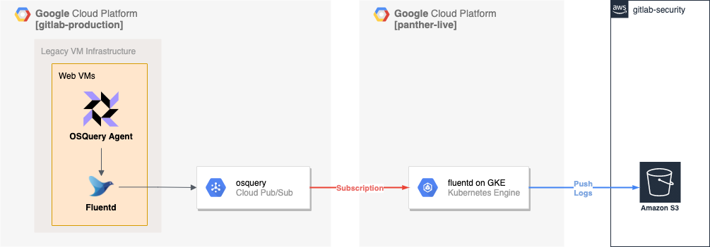

[[_TOC_]]

# Summary

[OSQuery](https://osquery.io/) is an operating system instrumentation framework,
providing an agent able to collect data from the underlying operating system
and to expose such data as a high-performance relational database.
This allows to write SQL queries to explore operating system data. With
osquery, SQL tables represent abstract concepts such as running processes,
loaded kernel modules, open network connections, browser plugins, hardware
events or file hashes.

Compliance requirements dictate that OSQuery has to be installed on each Virtual Machine running production workloads which have not yet been migrated to Kubernetes.
This means that an OSQuery agent has to be installed on the part of the
Gitlab's fleet still running directly on Google Compute Engine (called "*Legacy VM Infrastructure*" in the [Production Architecture Handbook Page](https://about.gitlab.com/handbook/engineering/infrastructure/production/architecture/#gitlab-com-architecture)).

Google Compute Engine machines which are part of a Kubernetes managed node group are exempt from this requirement, since security  visibility into Kubernetes will
be obtained via [Falco](https://falco.org/) at a later stage.

> Work for its deployment has been tracked in the "[OSQuery Deployment](https://gitlab.com/groups/gitlab-com/gl-security/security-operations/infrastructure-security/-/epics/3)" EPIC.

# Architecture

Starting from the Gitlab.com Architecture diagram, OSQuery will impact only
the "_Legacy VM Infrastructure_":

Within the "_Legacy VM Infrastructure_", each Compute Instance has an OSQuery Agent
running as a system service. OSQuery is deployed via a Chef Cookbook ([gitlab-osquery](https://gitlab.com/gitlab-cookbooks/gitlab-osquery)), which includes recipes and resources to install, configure, and start OSQuery. In particular, when run, the cookbook will:
* Install the `osquery` package, obtained from https://pkg.osquery.io
* Setup syslog ingestion
* Create configurations files (e.g., `/etc/osquery/osquery.conf`)
* Deploy query packs
* Start/enable the `osqueryd` service

Fluentd is used to collect the OSQuery output from the local filesystem (of the hosts running OSQuery) and to forward it to a Pub/Sub queue, entry point for Panther, the SIEM used by SIRT.
The Dedicated Pub/Sub Topics are defined in the Terraform variables of the [gitlab-com-infrastructure](https://ops.gitlab.net/gitlab-com/gitlab-com-infrastructure) repo (see [gstg](https://ops.gitlab.net/gitlab-com/gitlab-com-infrastructure/-/blob/master/environments/gstg/variables.tf#L660) and [gprd](https://ops.gitlab.net/gitlab-com/gitlab-com-infrastructure/-/blob/master/environments/gprd/variables.tf#L660)).
The [gitlab_fluentd](https://gitlab.com/gitlab-cookbooks/gitlab_fluentd) configuration has also been extended for processing logs generated by OSQuery (see [recipe](https://gitlab.com/gitlab-cookbooks/gitlab_fluentd/-/blob/master/recipes/osquery.rb) and [template](https://gitlab.com/gitlab-cookbooks/gitlab_fluentd/-/blob/master/templates/default/osquery.conf.erb)).
