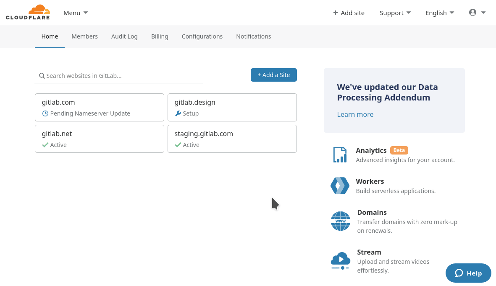

# Static repository objects caching

Static repository objects such as repository archives and raw blobs can be
served from an external storage such as a CDN, to relieve the application from
serving a fresh version of the object for every request.

This is achieved by redirecting requests to an object endpoint (e.g. `/archive/`
or `/raw/`) to the external storage, and in turn the external storage makes a
request to the origin, caches the response then serve it to subsequent requests
if the object hasn't expired yet. An example of the requests flow can be found
in the [docs][requests-flow-example].

## Enabling/Disabling external caching

Follow the [documented steps][configuring-docs] to enable external caching. The
arbitrary token can be found in 1Password (or should be stored if this is an
initial setup) under "[Environment] static objects external storage token" item
(replace [Environment] with "Staging" or "Production"). This token is also used
by Terraform, more on that below.

The base URL is endpoint that will serve the cached objects, it depends on the
CDN used. Currently, we use an entry point URL to a [Cloudflare
worker][cloudflare-worker], which is provisioned by Terraform, more on that
below.

To disable external caching, in the admin panel, simply set the External storage
URL field to an empty value, this will cause the application to stop redirecting
requests to the external storage and revert the static object paths to their
original form. In Terraform module configuration, set
[`enabled`][tf-enabled-var] to `false` to stop requests from reaching the
worker.

## Provisioning the external storage

The application makes no assumptions about the external storage, it only expects
a certain header to be set correctly in order to identify requests originating
from the external storage. As such, an external storage can be a Fastly service,
a FaaS, or a Cloudflare Worker. We use the latter for GitLab.com.

Using [Terraform][static-objects-cache-tf], we provision a worker; a worker
route; and a proxied DNS A record, all in Cloudflare.

The DNS record and the worker route are used primarily for cosmetic purposes, as
a worker domain may not be aesthetically pleasing to users. This DNS record is
provided to the application as an entry point URL (see above).

We can't use worker routes directly to handle caching as a route pattern doesn't
allow multiple wildcards in the path segment (i.e. we can't have such patterns
`*/-/archive/*`or `*/raw/*`). If the zone of the entry point domain is not
hosted by Cloudflare then we can't use worker routes and the raw worker domain
has to be used. If the worker domain is to be used, due to limitations in
Terraform's Cloudflare provider, the worker provisioned is not deployed
automatically, it has be to deployed manually through Cloudflare's dashboard.

## Operation modes

The worker can be configured to work in one of two modes: conservative and
aggressive. These modes **are** in terms of cache invalidating, **not** in terms
of caching itself. Also, it can be configured either cache private repository
objects or not.

These are configured through Terraform, through the
[`cache_private_objects`][tf-cache-private-objects-var] and
[`mode`][tf-mode-var] variables.

### Public repository objects

In conservative mode, the worker will immediately serve public objects if they
haven't expired yet. Expiry time is influenced by the `Cache-Control` header
returned by origin, specifically the `max-age` directive. Once an object is
expired, it will be evicted from cache and the worker will request it from
origin in full. This may be fine for small objects but may cause stress on the
origin for larger ones.

In aggressive mode, the worker invalidates the object every time it's request,
using the `ETag` value present in the cached response. The `Cache-Control`
header and its directives are ignored in this mode, which means the objects live
for longer period at the expense of frequent invalidation from the origin.

### Private repository objects

The worker can configured to either cache private repository objects or not. If
the latter, the worker acts as a proxy, without touching or caching the
response. The worker identifies private objects by looking for the `private`
directive in the `Cache-Control` header.

If enabled, any private object requested is invalidated regardless of the
current mode, to enforce authentication and authorization.

## Cloudflare caching behavior

We utilize [Cache API][cf-cache-api] in the worker script, this means cached
objects are not replicated across Cloudflare data centers. This is important to
know because, in aggressive mode, if a repository object is suddenly in a high
demand across the globe, we may observe a small surge of 200 responses as
opposed to the expected 304 ones. The 200s would be individual Cloudflare data
centers warming their caches, afterwards it should be a steady flow of 304s.

## Protection against cache bypassing

The worker script checks the query segment of each request, and only allows
query parameters expected by the application to go through. This is to prevent
malicious users from bypassing the cache by adding arbitrary query parameters.

The following rules are applied:

* For `/raw/` requests
  * `inline` query parameter is only allowed if its value is either `true` or
    `false`
* For `/archive/` requests
  * `append_sha` query parameter is only allowed if its value is either `true`
    or `false`
  * `path` query parameter is allowed regardless of its value

## Logging

Every request to the worker is logged in Elasticsearch, in an index with this
name format: `<environment>-static-objects-cache-<date>`. A scheduled [CI
pipeline][archive-pipeline] archives old indexes to the logs archive bucket in
GCS.

Elasticsearch endpoint and credentials are provided through [Terraform][tf-logging].

Cloudflare Logs wasn't used as it doesn't provide a way to filter logs for
certain routes or workers. Using it would cause logging redundancy if the site
is completely behind Cloudflare (as is the case with staging), and would prove
difficult to have immediate visibility into the worker as logs would need to be
imported from GCS (after they're exported from Cloudflare) to BigQuery for
analysis.

[requests-flow-example]: https://docs.gitlab.com/ee/administration/static_objects_external_storage.html#requests-flow-example
[configuring-docs]: https://docs.gitlab.com/ee/administration/static_objects_external_storage.html#configuring
[cloudflare-worker]: https://workers.cloudflare.com/
[static-objects-cache-tf]: https://gitlab.com/gitlab-com/gitlab-com-infrastructure/blob/da18f1d369aef059010a86cb414455f276c76787/environments/gstg/main.tf#L2201
[cf-cache-api]: https://developers.cloudflare.com/workers/reference/apis/cache/
[tf-cache-private-objects-var]: https://gitlab.com/gitlab-com/gitlab-com-infrastructure/blob/da18f1d369aef059010a86cb414455f276c76787/environments/gstg/main.tf#L2202
[tf-mode-var]: https://gitlab.com/gitlab-com/gitlab-com-infrastructure/blob/da18f1d369aef059010a86cb414455f276c76787/environments/gstg/main.tf#L2210
[tf-enabled-var]: https://ops.gitlab.net/gitlab-com/gitlab-com-infrastructure/blob/da18f1d369aef059010a86cb414455f276c76787/environments/gstg/main.tf#L2206
[tf-logging]: https://gitlab.com/gitlab-com/gitlab-com-infrastructure/blob/da18f1d369aef059010a86cb414455f276c76787/environments/gstg/main.tf#L2204-2205
[archive-pipeline]: https://ops.gitlab.net/gitlab-com/gl-infra/static-objects-cache-logs-exporter
