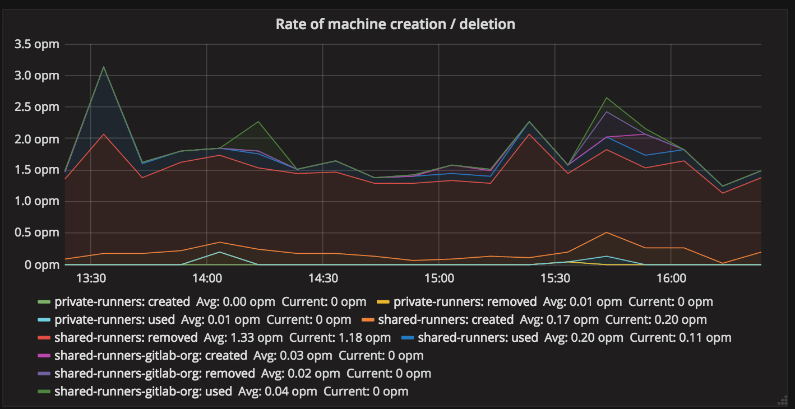
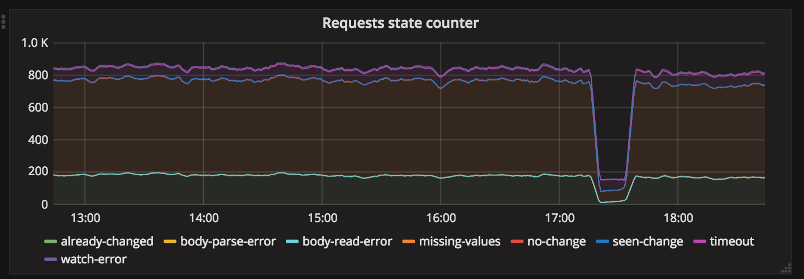
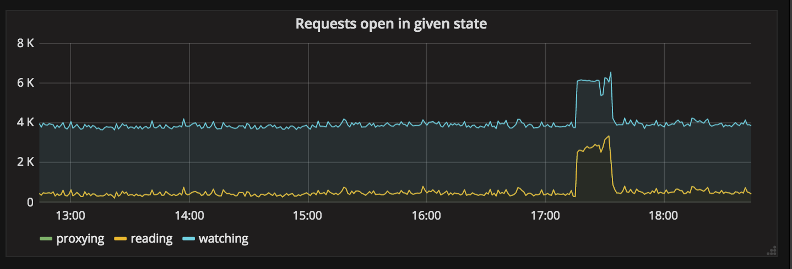
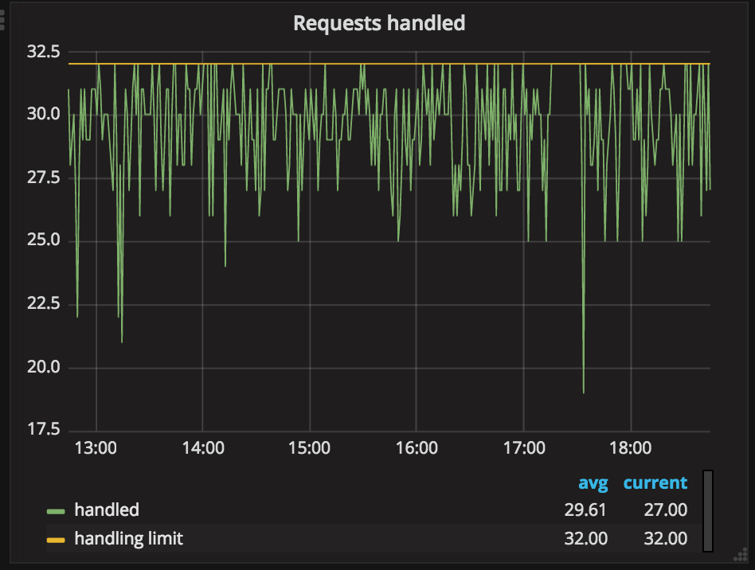
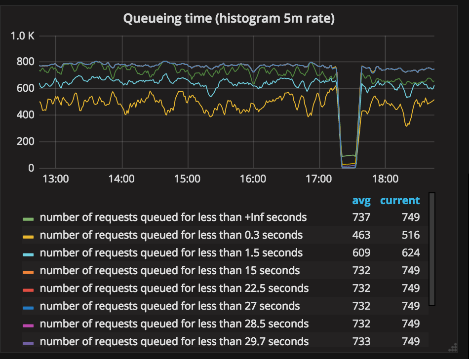

## CI graphs

When you go to https://performance.gitlab.net/dashboard/db/ci you will see a number of graphs.

This document tries to explain what you see and what each of the values does indicate.

## GitLab-view of Jobs


* **pending jobs for project with shared runners enabled**:
this is a list of "potential" builds that are in queue and could be picked by shared runners.
As of today it represents a number of jobs for projects that have shared runners enabled
and have pending jobs.
Currently, we cannot filter this value with "stuck builds",
"tag matching of runners" and "shared runners minutes".
So it is possible that this value is artificially high.
This is subject to be updated.

* **pending jobs for a project without shared runners enabled**:
Similar to previous one, but for projects that do not have shared runners.

* **running jobs on shared runners**:
Current value (from GitLab perspective) of jobs that run on runners marked as shared.

* **running jobs on specific runners**:
Current value (from GitLab perspective) of jobs that run on runners marked as specific.

* **stale jobs**:
Jobs that are "running" and were not updated for last hour.
This number may indicate a number of jobs that are considered dead, due to:
someone closing runner, runner crashing, etc.

## Runner-view of Jobs


These graphs represent data that are exported out of Runner Manager with Prometheus Exporter.

The first graph represents a number of currently running jobs on specific Runner Manager.

The second graph gathers data from GitLab perspective about a number of jobs running on:
* **private-runners** specific runners owned by GitLab Inc. (not all GitLab specific runners), currently it is: `docker-ci-X.gitlap.com`,
* **shared-runners-gitlab-org** shared runners owned by GitLab Inc. that are used for running jobs with tag `gitlab-org`: `gitlab-shared-runners-manager-X.gitlab.com`,
* **shared-runners** shared runners owned by GitLab Inc. that are used for running all public jobs `shared-runners-manager-X.gitlab.com`,

The third graphs represent runner point of view of how many jobs are right now in given stage.
Most of the stages are self-explanatory, excluding one:
* **stage**: currently the name of this is stage can be considered as an error.
This name indicates that job is currently on preparation phase: download docker images and configuring services.

## Runners Manager: Auto-scaling


This is a very important graph as it represents the health of auto-scaling.
You can read more about auto-scaling of Docker in this document:  https://gitlab.com/gitlab-org/gitlab-ci-multi-runner/blob/master/docs/configuration/autoscale.md#autoscaling-algorithm-and-parameters.

This graph is `gauge` so it doesn't represent rate of change,
but represent a state in given moment.

The naming of groups is the same as in the previous paragraph,
but what is interesting are the states:
* **acquired**: the number of machines that are "locked" as used for requesting jobs from GitLab,
it can translate to a number of requests executed by runner to job request endpoint of GitLab.
The high number is a result of change described in this MR: https://gitlab.com/gitlab-org/gitlab-ci-multi-runner/merge_requests/518.

* **creating**: the number of machines that are currently being provisioned that will be later used to run new builds,

* **idle**: the number of machines that are currently waiting idle and if needed can be used to run new builds,

* **used**: the number of machines that are currently assigned to specific received job as they are used to run job payload,

* **removing**: the number of machines that are currently being removed.

### How to interpret this data?

The low number of **idle** means that runner manager is unable to provide machines to demand the load.
It can be an indication of error, but may not really be.

The rate of Runner Manager machine "creation" is defined by [IdleCount](https://gitlab.com/gitlab-org/gitlab-ci-multi-runner/blob/master/docs/configuration/autoscale.md#how-current-limit-and-idlecount-generate-the-upper-limit-of-running-machines).
We can easily increase `IdleCount`,
but we need to be aware of rate limits of API that is used to provision new machines,
as it is possible that system will become unstable once we hit it.

## Runners Manager: rate of machine creation (Machines operations rates)



This is another interesting graph that gives insight into what is happening with auto-scaling.
This graph represents **counter** metric.

The meaning of name groups is equal to the ones from the previous graph.

### How to interpret this data?

The low number of **created** with a low number of **idle** from the previous graph may indicate that we are unable to create new machines.
It may be a problem of API, a problem of docker-machine, or just a bug in GitLab Runner.

High number of **created** with low number of **idle** may indicate that we are creating machines,
but these are machine are broken for some reason as they are very short living.

## Jobs queue

This graph represents a number of pending jobs that could be run by shared runners (but having in mind limitations described in *GitLab-view of Jobs*).

There's one group **namespace** which currently indicate all namespaces that at that time had less than 10 jobs.
This is the sink hole for all of them.
If this value is high it means that we have a lot of jobs for many namespaces,
which is also what should be expected.

Seeing **namespace** for specific ID with very high number may indicate an abuse.
It is worth to verify what is in that namespace.

## Workhorse Long polling

Workhorse Long Polling is to implement `builds/register` and `job/request` in long polling mode.
A request that is executed for 50s, and is watching for Redis value change.
If no value change is detected return an information that there's no build
currently available.

If the request cannot be handled it is proxied to GitLab.



This graph represents a number of hits for given state when handling job request in Workhorse:
* **body-parse-error**, **body-read-error**, **missing-values**: we received invalid body that is too large, is of invalid content or does not have all required arguments, in this case, request is proxied to GitLab,
* **watch-error**: we failed to start watcher process, request is proxied to GitLab,
* **no-change**: we received notification, but the current value of notification is the same as sent by Runner, we return no new jobs to Runner,
* **seen-change**: we received notification, and the value of notification is different then sent by Runner, we return no new jobs to Runner, runner will retry in a few seconds,
* **timeout**: we did not receive notification and request did timeout, we return no new jobs to Runner,
* **already-changed**: we did check the value of notification before starting watching, and it is different then sent by Runner, we proxy request to GitLab,

Here we aim to minimize the number of errors, as they indicate that request cannot be long polled, due to missing data (old runners), invalid body, etc.



This graph represents a current number of requests in given state:
* **reading**: Workhorse is reading request body, if client is slow to send body we can see some number here,
* **watching**: Workhorse is long polling request and watching for Redis change notification,
* **proxying**: Workhorse is proxying request to GitLab.

Generally, we try to increase **watching** and minimalize **proxying**.
Request that is in watching is long polled and executed for 50s currently.

## Workhorse Queueing

We use Workhorse Queueing request to limit the capacity that is given to job request endpoint.
Only this endpoint is affected by these changes. This allows us to easily control the percentage of the resources of a single server that job requesting can use.

All requests to this endpoint end up in the queue. The queue has:
* width: how many requests we can run concurrently,
* timeout: how long we allow request to be in queue,
* length: how many requests we allow to be in the queue.

Requests that:
* do end up in queue, but do timeout are rejected with: **503 Service Unavailable**,
* that cannot be put enqueued because we have more than limit are rejected with: **429 Too Many Requests**.

Seeing a large number of 429 means that someone is blocking the queue and we create a too big backlog,
but we can still process them in a reasonable time (lower than a timeout). So we reject them quickly.

Seeing large number of 503 means that most of the requests that do end up in the queue do timeout,
which also indicates that someone is blocking the queue, but also means that maybe our queue is too long.



This graph represents the current state of a number of requests that are being processed.
Seeing that value to hit the limit means that we have to queue and delay the job request processing.
This means that API endpoint with given capacity (width/length/timeout) is underperforming.

We aim to have **handled** to be as low as possible.


This graph represents a current number of requests that are enqueued.
Enqueued requests are delayed in order to slow down all runners to the point where we can process what they ask for.
High value indicates the same as previously, API endpoint with given capacity is underperforming.



This graph represents the delay introduced to requests.
The high delay means that we have to significantly slow down job requests to handle the demand.

We expect this value to be as low as possible.

## Runners uptime

This graph represents runners uptime. We expect the values to not change very often.

If we see that some of the runners die at very unpredictable times it is an indicator of Runner Manager crashes.

We should log into this runner and check if we did have panics in last time:

```
grep panic /var/log/syslog
```
