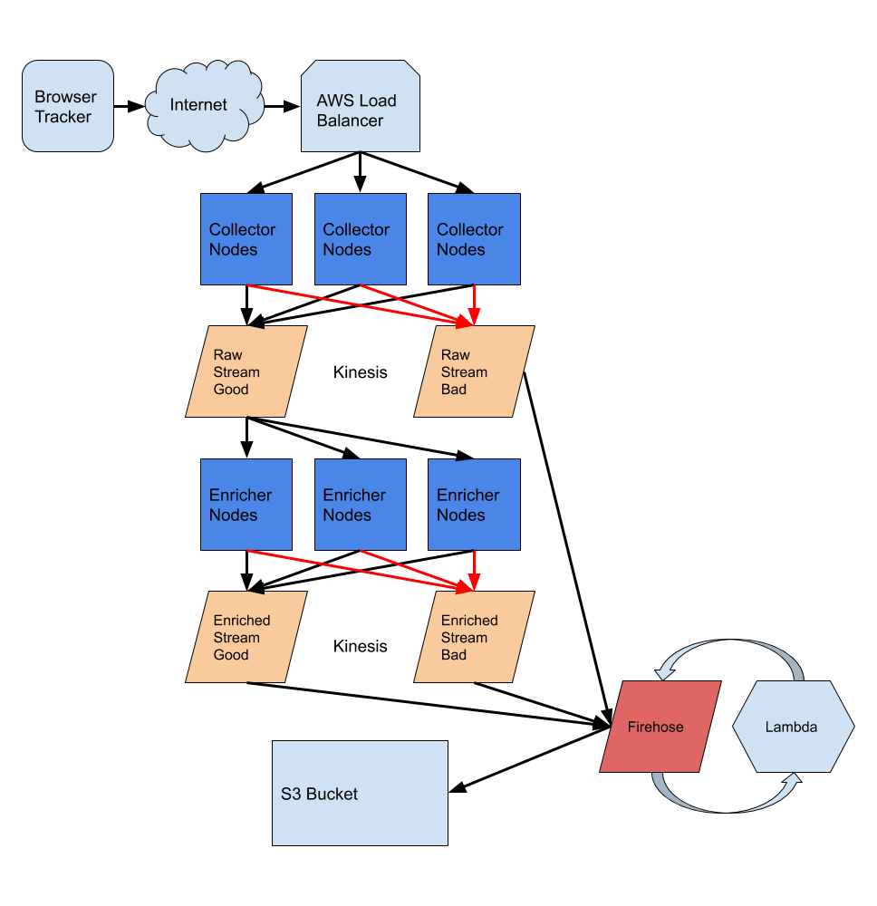

# [SnowPlow](https://github.com/snowplow/snowplow/wiki/snowplow-tracker-protocol)

SnowPlow is a pipeline of nodes and streams that is used to accept events from
the GitLab.com front-end web tracker. The tracker is javascript that is
executed by a user's browser.

All of the SnowPlow pipeline components live in AWS GPRD account: 855262394183

* [Design Document](https://about.gitlab.com/handbook/engineering/infrastructure/design/snowplow/)
* [Terraform Configuration](https://ops.gitlab.net/gitlab-com/gitlab-com-infrastructure/tree/master/environments/aws-snowplow)
* [CloudWatch Dashboard](https://console.aws.amazon.com/cloudwatch/home?region=us-east-1#dashboards:name=SnowPlow)

## The Pipeline Diagram


## What is important?
If you are reading this, most likely one of two things has gone wrong. Either
the SnowPlow pipeline has stopped accepting events or it has stopped writing
events to the S3 bucket. Not accepting requests is a big problem and it
should be fixed as soon as possible. Collecting events is important and a
synchronous process.

Processing events and writing them out is important, but not as time sensitive.
There is some slack in the queue to allow a events to stack up before being
written. The raw events Kinesis stream has a data retention period of 48 hours.
This can be altered if needed in a dire situation. [Kinesis Stream Configuration](https://ops.gitlab.net/gitlab-com/gitlab-com-infrastructure/blob/master/environments/aws-snowplow/main.tf#L384-443)

## Not accepting requests
1. A quick curl check should give you a good response of **OK**. This same URL
is used for individual collector nodes to check health against port 8000.
  - ```curl https://snowplow.trx.gitlab.net/health```
1. Log into GPRD AWS and verify that there are collector nodes in the
  **SnowPlowNLBTargetGroup** target group. If not, something has gone wrong
  with the **SnowPlowCollector** auto scaling group.
1. Check Route53 in AWS and verify that snowplow.trx.gitlab.net is still
  pointing to the SnowPlow load balancer. This should be a CNAME.
1. If there are collectors running, you can SSH into them and look at the logs.
  You should find them in **/snowplow/logs**.
1. Are the collectors writing events to the raw (good or bad) Kinesis streams?
  You can look at the SnowPlow dashboard in CloudWatch, or go to the Kinesis
  service in AWS and look at the stream monitoring tabs.

## Not writing events out
1. First, make sure the collectors are working ok by looking over the steps
  above. It's possible that if nothing is getting collected, nothing is being
  written out.
1. Verify there are enricher nodes running. You can check the
  **SnowPlowEnricher** auto scaling group to see if they are.
1. There is no current automated method to see if the enricher processes are
  running on the nodes. You may need to SSH into them and check that the
  java process is running and look at the logs in **/snowplow/logs**.
1. Are the enricher nodes picking up events and writing them into the enriched
  Kinesis streams? Look for the Kinesis stream monitoring tabs.
1. Check that the Kinesis Firehose monitoring for the enriched (good and bad)
  streams are processing events. You may want to turn on CloudWatch logging
  if you are stuck and can't seem to figure out what's wrong.
1. Check the Lambda function that is used to process events in Firehose. There
  should be plenty of invocations at any time of day. A graph of invocations
  is on the [CloudWatch SnowPlow dashboard](https://console.aws.amazon.com/cloudwatch/home?region=us-east-1#dashboards:name=SnowPlow).

## SSH Access to nodes
You will need the ```snowplow.pem``` file from 1Password and you will connect to
the nodes as the ```ec2-user```.
